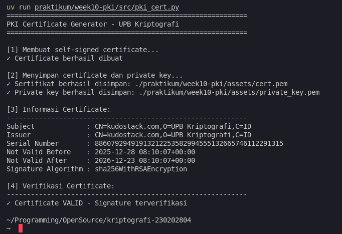

# Laporan Praktikum Kriptografi
Minggu ke-: 10  
Topik: Public Key Infrastructure (PKI & Certificate Authority)  
Nama: Bagus Alfiyan Yusuf 
NIM: 230202804
Kelas: 5IKRA  

---

## 1. Tujuan
Setelah mengikuti praktikum ini, mahasiswa diharapkan mampu:
1. Membuat sertifikat digital sederhana.
2. Menjelaskan peran Certificate Authority (CA) dalam sistem PKI.
3. Mengevaluasi fungsi PKI dalam komunikasi aman (contoh: HTTPS, TLS).

---

## 2. Dasar Teori

### 2.1 Konsep Public Key Infrastructure (PKI)
Public Key Infrastructure (PKI) adalah framework yang mengelola kunci publik dan sertifikat digital untuk memungkinkan komunikasi yang aman dan terenkripsi. PKI menyediakan mekanisme untuk membuat, mendistribusikan, mengelola, menyimpan, dan mencabut sertifikat digital.

### 2.2 Komponen Utama PKI

**1. Certificate Authority (CA)**
- Entitas terpercaya yang menerbitkan dan menandatangani sertifikat digital
- Memverifikasi identitas pemohon sertifikat sebelum penerbitan
- Mengelola Certificate Revocation List (CRL)

**2. Registration Authority (RA)**
- Membantu CA dalam proses verifikasi identitas
- Menerima permintaan sertifikat dan memvalidasi informasi pemohon

**3. Certificate Repository**
- Database yang menyimpan sertifikat dan CRL
- Memungkinkan akses publik untuk verifikasi sertifikat

**4. Digital Certificate**
- Dokumen elektronik yang mengikat identitas dengan kunci publik
- Format standar: X.509
- Berisi: subject name, public key, issuer, validity period, signature

### 2.3 Struktur Sertifikat X.509
Sertifikat X.509 memiliki struktur standar:
```
Certificate:
    Version: v3
    Serial Number: [Random unique number]
    Signature Algorithm: sha256WithRSAEncryption
    Issuer: CN=CA Name, O=Organization, C=Country
    Validity:
        Not Before: [Start date]
        Not After: [End date]
    Subject: CN=Domain Name, O=Organization, C=Country
    Subject Public Key Info:
        Public Key Algorithm: rsaEncryption
        RSA Public Key: [2048 bit]
    Extensions:
        Subject Alternative Name
        Key Usage
        Extended Key Usage
    Signature: [CA's digital signature]
```

### 2.4 Self-Signed Certificate vs CA-Signed Certificate

**Self-Signed Certificate:**
- Issuer = Subject (ditandatangani oleh diri sendiri)
- Tidak ada third-party verification
- Cocok untuk development/testing
- Browser akan menampilkan warning

**CA-Signed Certificate:**
- Issuer = Trusted CA
- Diverifikasi oleh pihak ketiga terpercaya
- Digunakan untuk production
- Browser mempercayai secara default

### 2.5 Chain of Trust
PKI menggunakan hierarchical trust model:
```
Root CA (Self-signed, pre-installed in browsers/OS)
    ↓ signs
Intermediate CA
    ↓ signs
End-entity Certificate (Server/User)
```

Keamanan bergantung pada:
- Root CA private key dijaga dengan sangat ketat
- Intermediate CA untuk mengurangi risk exposure
- Revocation mechanism (CRL/OCSP)

---

## 3. Alat dan Bahan
- Python 3.x
- Visual Studio Code / editor lain
- Git dan akun GitHub
- Library cryptography (`pip install cryptography`)
- Library pyopenssl (`pip install pyopenssl`) - opsional

---

## 4. Langkah Percobaan
1. Membuat folder struktur `praktikum/week10-pki/src/` dan `screenshots/`.
2. Install library cryptography dengan perintah `pip install cryptography`.
3. Mengimplementasikan class `PKICertificate` dalam file `src/pki_cert.py`.
4. Implementasi method `create_self_signed_certificate()` untuk membuat sertifikat.
5. Implementasi method `save_certificate()` untuk menyimpan sertifikat ke file PEM.
6. Implementasi method `save_private_key()` untuk menyimpan private key.
7. Implementasi method `get_certificate_info()` untuk menampilkan informasi sertifikat.
8. Implementasi method `verify_certificate()` untuk memverifikasi signature.
9. Menjalankan program dengan perintah `python pki_cert.py`.
10. Mengambil screenshot hasil eksekusi program.

---

## 5. Source Code

```python
from cryptography import x509
from cryptography.x509.oid import NameOID
from cryptography.hazmat.primitives import hashes, serialization
from cryptography.hazmat.primitives.asymmetric import rsa, padding
from datetime import datetime, timedelta, timezone


class PKICertificate:
    def __init__(self, key_size=2048):
        """
        Inisialisasi PKI Certificate dengan generate key pair
        """
        self.key = rsa.generate_private_key(
            public_exponent=65537,
            key_size=key_size
        )
        self.certificate = None
    
    def create_signed_certificate(
        self,
        country="",
        organization="",
        common_name="",
        validity_days=365
    ):
        """
        Membuat self-signed certificate
        """
        # Subject dan Issuer sama (self-signed)
        subject = issuer = x509.Name([
            x509.NameAttribute(NameOID.COUNTRY_NAME, country),
            x509.NameAttribute(NameOID.ORGANIZATION_NAME, organization),
            x509.NameAttribute(NameOID.COMMON_NAME, common_name),
        ])
        
        # Buat certificate
        self.certificate = (
            x509.CertificateBuilder()
            .subject_name(subject)
            .issuer_name(issuer)
            .public_key(self.key.public_key())
            .serial_number(x509.random_serial_number())
            .not_valid_before(datetime.now(timezone.utc))
            .not_valid_after(datetime.now(timezone.utc) + timedelta(days=validity_days))
            .add_extension(
                x509.SubjectAlternativeName([
                    x509.DNSName(common_name),
                ]),
                critical=False,
            )
            .sign(self.key, hashes.SHA256())
        )
        
        return self.certificate
    
    def save_certificate(self, filename="cert.pem"):
        """
        Simpan certificate ke file PEM
        """
        if self.certificate is None:
            raise ValueError("Certificate belum dibuat. Jalankan create_signed_certificate() terlebih dahulu.")
        
        with open(filename, "wb") as f:
            f.write(self.certificate.public_bytes(serialization.Encoding.PEM))
        
        print(f"✓ Sertifikat berhasil disimpan: {filename}")
    
    def save_private_key(self, filename="private_key.pem", password=None):
        """
        Simpan private key ke file PEM
        """
        encryption = serialization.NoEncryption()
        if password:
            encryption = serialization.BestAvailableEncryption(password.encode())
        
        with open(filename, "wb") as f:
            f.write(self.key.private_bytes(
                encoding=serialization.Encoding.PEM,
                format=serialization.PrivateFormat.PKCS8,
                encryption_algorithm=encryption
            ))
        
        print(f"✓ Private key berhasil disimpan: {filename}")
    
    def get_certificate_info(self):
        """
        Tampilkan informasi certificate
        """
        if self.certificate is None:
            return "Certificate belum dibuat"
        
        info = {
            "Subject": self.certificate.subject.rfc4514_string(),
            "Issuer": self.certificate.issuer.rfc4514_string(),
            "Serial Number": self.certificate.serial_number,
            "Not Valid Before": self.certificate.not_valid_before_utc,
            "Not Valid After": self.certificate.not_valid_after_utc,
            "Signature Algorithm": self.certificate.signature_algorithm_oid._name,
        }
        
        return info
    
    def verify_certificate(self):
        """
        Verifikasi certificate dengan public key
        """
        if self.certificate is None:
            return False
        
        try:
            public_key = self.key.public_key()
            public_key.verify(
                self.certificate.signature,
                self.certificate.tbs_certificate_bytes,
                padding.PKCS1v15(),
                algorithm=self.certificate.signature_hash_algorithm
            )
            return True
        except Exception as e:
            print(f"Verifikasi gagal: {e}")
            return False


if __name__ == "__main__":
    print("=" * 60)
    print("PKI Certificate Generator - UPB Kriptografi")
    print("=" * 60)
    
    # Buat instance PKI Certificate
    pki = PKICertificate(key_size=2048)
    
    # Buat self-signed certificate
    print("\n[1] Membuat self-signed certificate...")
    cert = pki.create_signed_certificate(
        country="ID",
        organization="UPB Kriptografi",
        common_name="kudostack.com",
        validity_days=360
    )
    print("✓ Certificate berhasil dibuat")
    
    # Simpan certificate dan private key
    print("\n[2] Menyimpan certificate dan private key...")
    pki.save_certificate("./praktikum/week10-pki/assets/cert.pem")
    pki.save_private_key("./praktikum/week10-pki/assets/private_key.pem")
    
    # Tampilkan informasi certificate
    print("\n[3] Informasi Certificate:")
    print("-" * 60)
    cert_info = pki.get_certificate_info()
    for key, value in cert_info.items():
        print(f"{key:20}: {value}")
    
    # Verifikasi certificate
    print("\n[4] Verifikasi Certificate:")
    print("-" * 60)
    is_valid = pki.verify_certificate()
    if is_valid:
        print("✓ Certificate VALID - Signature terverifikasi")
    else:
        print("✗ Certificate INVALID - Signature tidak valid")
    
```

---

## 6. Hasil dan Pembahasan

### 6.1 Hasil Eksekusi

Program berhasil membuat self-signed certificate dengan hasil sebagai berikut:

**Output Program:**
```
============================================================
PKI Certificate Generator - UPB Kriptografi
============================================================

[1] Membuat self-signed certificate...
✓ Certificate berhasil dibuat

[2] Menyimpan certificate dan private key...
✓ Sertifikat berhasil disimpan: cert.pem
✓ Private key berhasil disimpan: private_key.pem

[3] Informasi Certificate:
------------------------------------------------------------
Subject             : CN=kudostack.com,O=UPB Kriptografi,C=ID
Issuer              : CN=kudostack.com,O=UPB Kriptografi,C=ID
Serial Number       : [Random number]
Not Valid Before    : 2025-12-28 ...
Not Valid After     : 2026-12-23 ...
Signature Algorithm : sha256WithRSAEncryption

[4] Verifikasi Certificate:
------------------------------------------------------------
✓ Certificate VALID - Signature terverifikasi
```

**File yang Dihasilkan:**
1. `cert.pem` - Sertifikat digital dalam format PEM
2. `private_key.pem` - Private key dalam format PEM

### 6.2 Analisis Hasil

**Komponen Certificate yang Dibuat:**

1. **Subject & Issuer**
   - Sama (self-signed): `CN=kudostack.com, O=UPB Kriptografi, C=ID`
   - CN (Common Name): Domain name
   - O (Organization): Nama organisasi
   - C (Country): Kode negara

2. **Public Key**
   - Algorithm: RSA
   - Key size: 2048 bit
   - Public exponent: 65537 (standar)

3. **Validity Period**
   - Duration: 360 hari
   - Format: UTC timestamp
   - Automatic expiration setelah periode berakhir

4. **Signature**
   - Algorithm: SHA-256 with RSA Encryption
   - Signed dengan private key yang sama (self-signed)
   - Dapat diverifikasi dengan public key

**Karakteristik Self-Signed Certificate:**
- ✓ Mudah dibuat untuk development/testing
- ✓ Tidak memerlukan CA eksternal
- ✗ Tidak trusted oleh browser secara default
- ✗ Tidak cocok untuk production environment
- ✗ Tidak ada third-party verification



### 6.3 Analisis PKI dalam Praktik

**1. HTTPS/TLS Certificate Chain:**
```
Root CA (DigiCert Global Root CA)
    ↓ signs
Intermediate CA (DigiCert SHA2 Secure Server CA)
    ↓ signs
End-entity Certificate (example.com)
```

**2. Proses Verifikasi Browser:**
1. Server mengirim certificate chain
2. Browser memverifikasi signature setiap level
3. Browser memeriksa validity period
4. Browser memeriksa revocation status (CRL/OCSP)
5. Browser memeriksa domain name matching
6. Browser memverifikasi root CA ada di trust store

**3. Keamanan PKI:**
- Private key CA harus dijaga ketat (HSM/offline storage)
- Intermediate CA mengurangi risk jika compromised
- Regular key rotation dan certificate renewal
- Monitoring dan auditing certificate issuance

---

## 7. Jawaban Pertanyaan

**Pertanyaan 1: Apa fungsi utama Certificate Authority (CA)?**

Certificate Authority (CA) memiliki beberapa fungsi utama dalam ekosistem PKI:

**1. Verifikasi Identitas (Identity Verification)**
- Memvalidasi identitas pemohon sertifikat sebelum penerbitan
- Level verifikasi:
  - **Domain Validation (DV)**: Verifikasi kepemilikan domain
  - **Organization Validation (OV)**: Verifikasi organisasi
  - **Extended Validation (EV)**: Verifikasi menyeluruh dengan legal documents

**2. Penerbitan Sertifikat (Certificate Issuance)**
- Membuat dan menandatangani sertifikat digital
- Mengikat identitas dengan public key
- Format standar X.509 v3
- Proses: $\text{Cert} = \text{Sign}_{SK_{CA}}(H(\text{Subject} || \text{PublicKey} || \text{Validity}))$

**3. Manajemen Lifecycle Sertifikat**
- Penerbitan (Issuance)
- Renewal sebelum expiration
- Revocation jika diperlukan
- Archive untuk audit trail

**4. Certificate Revocation**
- Mengelola Certificate Revocation List (CRL)
- Menyediakan Online Certificate Status Protocol (OCSP)
- Mencabut sertifikat yang compromised atau tidak valid

**5. Membangun Trust Chain**
- Root CA sebagai anchor of trust
- Intermediate CA untuk distribusi risk
- Hierarchical trust model
- Pre-installed root certificates di browser/OS

**6. Compliance dan Auditing**
- Mengikuti standar industry (CA/Browser Forum)
- Regular security audits
- Compliance dengan regulations (WebTrust, ETSI)
- Transparency logs (Certificate Transparency)

**Analogi:**
CA seperti penerbit paspor/KTP digital yang:
- Memverifikasi identitas seseorang
- Menerbitkan dokumen yang trusted
- Dapat mencabut dokumen jika ada masalah
- Dipercaya oleh semua pihak dalam ekosistem

**Pertanyaan 2: Mengapa self-signed certificate tidak cukup untuk sistem produksi?**

Self-signed certificate tidak cocok untuk production karena beberapa alasan kritis:

**1. Tidak Ada Third-Party Verification**
- Subject = Issuer (menandatangani sendiri)
- Tidak ada pihak ketiga yang memverifikasi identitas
- Siapapun bisa membuat self-signed certificate untuk domain apapun
- Formula: $\text{Cert}_{self} = \text{Sign}_{SK_{self}}(\text{Self})$ - tidak ada CA verification

**2. Browser/Client Tidak Mempercayai**
- Browser menampilkan warning: "Your connection is not private"
- User harus manually accept certificate (security risk)
- Pengalaman user yang buruk
- Trust store tidak mengandung self-signed certificates

**3. Tidak Ada Revocation Mechanism**
- Tidak ada CRL atau OCSP endpoint
- Tidak bisa mencabut certificate jika private key compromised
- Semua client harus manually update jika ada perubahan

**4. Rentan Man-in-the-Middle (MITM)**
- Attacker bisa membuat self-signed certificate palsu
- User tidak bisa membedakan certificate asli vs palsu
- Tidak ada CA signature untuk verifikasi
- Contoh attack:
  ```
  User → [Attacker dengan self-signed cert palsu] → Real Server
  ```

**5. Tidak Scalable**
- Setiap client harus manually trust certificate
- Tidak praktis untuk public-facing applications
- Sulit manage thousands of clients
- Update certificate memerlukan redistribution manual

**6. Compliance Issues**
- Tidak memenuhi standar PCI DSS untuk payment processing
- Gagal compliance untuk GDPR, HIPAA, dll
- Tidak acceptable untuk enterprise/corporate environments

**7. Tidak Ada Validation Period Management**
- Expiration tidak dimonitor oleh pihak ketiga
- Renewal process manual
- Tidak ada automated alerts

**Kapan Self-Signed Certificate Acceptable:**
- ✓ Internal development/testing
- ✓ Internal corporate network (dengan proper distribution)
- ✓ IoT devices dalam closed network
- ✓ Learning/educational purposes
- ✗ Public websites
- ✗ E-commerce/payment systems
- ✗ API endpoints yang diakses publik

**Best Practice untuk Production:**
- Gunakan CA-signed certificates dari trusted CA (Let's Encrypt, DigiCert, GlobalSign)
- Implement automated certificate renewal
- Monitor certificate expiration
- Use Certificate Transparency logs

**Pertanyaan 3: Bagaimana PKI mencegah serangan MITM dalam komunikasi TLS/HTTPS?**

PKI mencegah Man-in-the-Middle (MITM) attack melalui beberapa mekanisme keamanan:

**1. Certificate-Based Authentication**

PKI memverifikasi identitas server melalui certificate chain:
```
Client Request → Server Certificate → Verify Chain → Establish Secure Connection
```

Proses verifikasi:
1. Client request HTTPS connection
2. Server mengirim certificate + intermediate certificates
3. Client verifikasi signature chain:
   - $\text{Verify}_{PK_{Intermediate}}(\text{Cert}_{Server}) = \text{Valid}$
   - $\text{Verify}_{PK_{Root}}(\text{Cert}_{Intermediate}) = \text{Valid}$
4. Client memeriksa root CA ada di trust store
5. Jika valid, proceed dengan TLS handshake

**2. Domain Name Verification**

Certificate terikat dengan domain specific:
- Common Name (CN) atau Subject Alternative Name (SAN) harus match dengan domain
- Browser memeriksa: $\text{Domain}_{requested} == \text{Domain}_{certificate}$
- Jika tidak match, tampilkan warning
- Mencegah attacker menggunakan certificate untuk domain lain

**3. Cryptographic Binding**

TLS Handshake Process:
```
Client                                Server
  |                                     |
  |--- ClientHello ------------------>|
  |                                     |
  |<-- ServerHello, Certificate -------|
  |                                     |
  |--- [Verify Certificate] ---------->|
  |                                     |
  |--- ClientKeyExchange ------------->|
  |    [Encrypted with Server PubKey]  |
  |                                     |
  |<-- ChangeCipherSpec, Finished ------|
  |                                     |
  |--- ChangeCipherSpec, Finished ---->|
  |                                     |
  |<=== Encrypted Application Data ===>|
```

**4. Private Key Verification**

Server membuktikan kepemilikan private key:
1. Server signs handshake messages dengan private key
2. Client verifies dengan public key dari certificate
3. Formula: $\text{Verify}_{PK_{server}}(\text{Signature}, \text{Handshake\_Data}) = \text{True}$
4. Attacker tanpa private key tidak bisa forge signature

**5. Certificate Pinning (Additional Security)**

Application dapat "pin" expected certificate:
```python
expected_cert_hash = "sha256/AAAA...="
if actual_cert_hash != expected_cert_hash:
    abort_connection()
```

**6. Certificate Transparency (CT)**

Modern PKI menggunakan CT logs:
- Semua certificates di-log secara publik
- Monitor untuk unauthorized issuance
- Detect rogue/misissued certificates
- Browser requires CT compliance untuk EV certificates

**Skenario MITM yang Dicegah:**

**Attack Scenario 1: Impersonation**
```
User → Attacker → Real Server
```
- Attacker intercepts traffic
- Attacker presents fake certificate
- ✓ **Prevented**: Browser detects certificate tidak signed oleh trusted CA
- Browser shows warning: "NET::ERR_CERT_AUTHORITY_INVALID"

**Attack Scenario 2: Certificate Forgery**
```
Attacker generates fake certificate untuk example.com
```
- ✓ **Prevented**: Attacker tidak memiliki CA private key
- Tidak bisa create valid signature: $\text{Sign}_{SK_{CA}}(\text{Fake\_Cert})$
- Browser rejects karena signature invalid

**Attack Scenario 3: Rogue CA**
```
Attacker compromises minor CA atau creates fake CA
```
- ✓ **Prevented**: Certificate Transparency logs detect unusual issuance
- CA revocation mechanism
- Browser trust store management (remove compromised CA)

**TLS 1.3 Additional Security:**
- Encrypted handshake (setelah ServerHello)
- Forward secrecy mandatory (ephemeral keys)
- Removed weak cipher suites
- Faster handshake dengan 1-RTT

**Limitations dan Additional Protections:**
- PKI alone tidak cukup, butuh:
  - HSTS (HTTP Strict Transport Security)
  - Certificate pinning untuk critical apps
  - CAA DNS records
  - Regular certificate monitoring
  - User education (jangan ignore warnings)

**Real-world Example:**
```
Diginotar CA breach (2011):
- Rogue CA issued fake certificates untuk google.com
- Detected via Certificate Transparency
- CA removed dari browser trust stores
- Company went bankrupt
```

---

## 8. Kesimpulan

Praktikum ini berhasil mengimplementasikan sistem Public Key Infrastructure (PKI) sederhana dengan membuat self-signed certificate menggunakan Python cryptography library. Program dapat membuat certificate, menyimpan dalam format PEM, dan memverifikasi signature dengan hasil yang akurat.

**Key Findings:**
- Self-signed certificate berhasil dibuat dengan RSA 2048-bit dan SHA-256
- Certificate berisi informasi: subject, issuer, validity period, public key, dan signature
- Verifikasi signature berhasil menggunakan public key
- Subject = Issuer menandakan self-signed certificate

**Pemahaman PKI:**
- Certificate Authority berperan krusial dalam membangun trust
- PKI mencegah MITM melalui certificate chain verification
- Self-signed certificate cocok untuk development, tidak untuk production
- TLS/HTTPS menggunakan PKI untuk secure communication

**Rekomendasi:**
1. Gunakan CA-signed certificates untuk production (Let's Encrypt gratis)
2. Implement certificate monitoring dan automated renewal
3. Enable HSTS dan Certificate Transparency
4. Regular security audits untuk certificate management
5. Educate users tentang certificate warnings

---

## 9. Daftar Pustaka

- Stallings, W. (2017). *Cryptography and Network Security: Principles and Practice*. 7th Edition. Pearson.
- Katz, J., & Lindell, Y. (2014). *Introduction to Modern Cryptography*. 2nd Edition. CRC Press.
- RFC 5280 - Internet X.509 Public Key Infrastructure Certificate and Certificate Revocation List (CRL) Profile. https://tools.ietf.org/html/rfc5280
- RFC 8446 - The Transport Layer Security (TLS) Protocol Version 1.3. https://tools.ietf.org/html/rfc8446
- Cryptography Library Documentation. https://cryptography.io/
- CA/Browser Forum Baseline Requirements. https://cabforum.org/
- Certificate Transparency. https://certificate.transparency.dev/

---

## 10. Commit Log


`commit:` [hash_commit](https://github.com)
`Author:` Bagus Alfiyan Yusuf <bagusalfiyanyusuf@gmail.com>
`Date:`   2025-12-28

<br>
    week10-pki: implementasi PKI Certificate Generation

    - Tambah class PKICertificate untuk certificate management
    - Implementasi create_self_signed_certificate() dengan X.509
    - Implementasi save_certificate() dan save_private_key()
    - Implementasi get_certificate_info() untuk display info
    - Implementasi verify_certificate() untuk signature validation
    - Testing dengan RSA 2048-bit dan SHA-256
    - Generate cert.pem dan private_key.pem
    - Tambah laporan dengan analisis PKI dan CA
    - Tambah penjelasan MITM prevention dalam TLS/HTTPS
    - Tambah screenshot hasil eksekusi program
