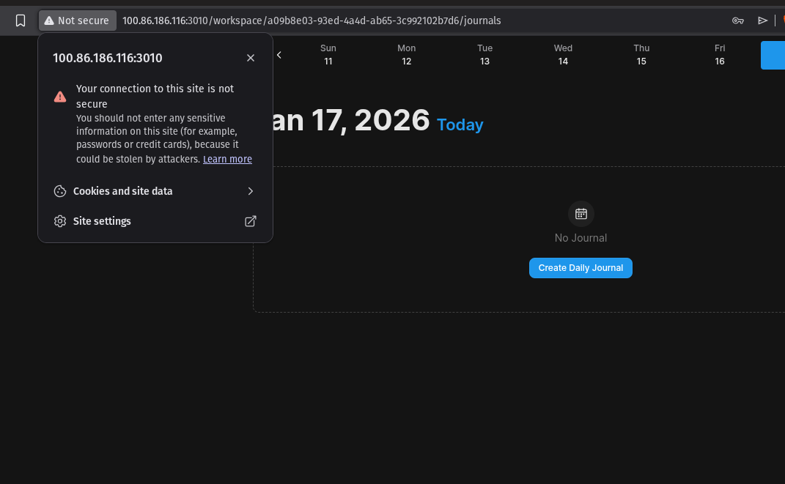
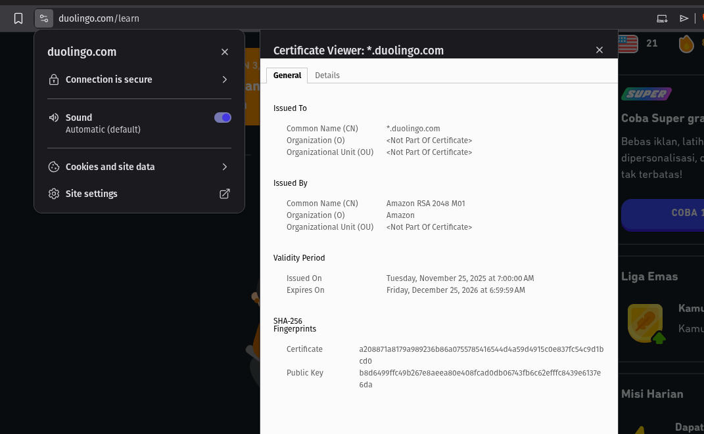

# Laporan Praktikum Kriptografi
Minggu ke-: 12  
Topik: Aplikasi TLS & E-commerce  
Nama: Bagus Alfiyan Yusuf  
NIM: 230202804  
Kelas: 5IKRA  

---

## 1. Tujuan
Setelah mengikuti praktikum ini, mahasiswa diharapkan mampu:
1. Menganalisis penggunaan kriptografi pada **email** dan **SSL/TLS**.
2. Menjelaskan enkripsi dalam transaksi **e-commerce**.
3. Mengevaluasi isu **etika & privasi** dalam penggunaan kriptografi di kehidupan sehari-hari.

---

## 2. Dasar Teori

### 2.1 SSL/TLS (Secure Sockets Layer / Transport Layer Security)

**SSL/TLS** adalah protokol kriptografi yang menyediakan komunikasi aman melalui jaringan komputer. TLS adalah versi yang lebih baru dan lebih aman dari SSL. Protokol ini digunakan secara luas untuk mengamankan komunikasi web (HTTPS), email, instant messaging, dan voice-over-IP (VoIP).

**Fungsi Utama TLS:**
1. **Enkripsi**: Melindungi data dari penyadapan (eavesdropping)
2. **Integritas**: Memastikan data tidak dimodifikasi selama transit
3. **Autentikasi**: Memverifikasi identitas server (dan kadang client)

### 2.2 Sertifikat Digital (Digital Certificate)

Sertifikat digital adalah dokumen elektronik yang menggunakan digital signature untuk mengikat public key dengan identitas pemiliknya. Sertifikat mengikuti standar **X.509** dan diterbitkan oleh **Certificate Authority (CA)** yang terpercaya.

**Komponen Sertifikat Digital:**
- **Subject**: Identitas pemilik sertifikat (domain name)
- **Issuer**: CA yang menerbitkan sertifikat
- **Validity Period**: Masa berlaku sertifikat
- **Public Key**: Kunci publik untuk enkripsi
- **Signature**: Tanda tangan digital dari CA

### 2.3 TLS Handshake Process

Proses TLS Handshake melibatkan beberapa langkah:
1. **ClientHello**: Client mengirim cipher suites yang didukung
2. **ServerHello**: Server memilih cipher suite dan mengirim sertifikat
3. **Certificate Verification**: Client memverifikasi sertifikat server
4. **Key Exchange**: Pertukaran kunci simetrik menggunakan asymmetric encryption
5. **Finished**: Kedua pihak beralih ke symmetric encryption untuk data transfer

### 2.4 HTTP vs HTTPS

**HTTP (Hypertext Transfer Protocol):**
- Data dikirim dalam plaintext (tidak terenkripsi)
- Rentan terhadap eavesdropping dan Man-in-the-Middle (MITM) attacks
- Tidak ada verifikasi identitas server

**HTTPS (HTTP Secure):**
- HTTP over TLS/SSL
- Data terenkripsi menggunakan symmetric encryption (AES)
- Autentikasi server menggunakan sertifikat digital
- Integritas data dijamin dengan MAC (Message Authentication Code)

---

## 3. Alat dan Bahan
- Google Chrome / Mozilla Firefox (untuk inspeksi sertifikat)
- Koneksi internet untuk mengakses website HTTPS
- Developer Tools browser
- Git dan akun GitHub
- Markdown editor

---

## 4. Langkah Percobaan

### Langkah 1: Analisis Sertifikat Website Tanpa HTTPS
1. Membuka website dengan protokol HTTP (non-secure)
2. Mengamati warning "Not secure" pada address bar
3. Mengklik icon warning untuk melihat detail keamanan
4. Mengambil screenshot warning message
5. Mencatat risiko keamanan yang ditampilkan

### Langkah 2: Analisis Sertifikat Website dengan HTTPS
1. Membuka website e-commerce/platform (contoh: duolingo.com)
2. Mengklik icon padlock di address bar
3. Memilih "Connection is secure" kemudian "Certificate is valid"
4. Menganalisis informasi sertifikat:
   - Issued To (Subject)
   - Issued By (Issuer/CA)
   - Validity Period
   - Public Key dan Signature Algorithm
5. Mengambil screenshot Certificate Viewer

### Langkah 3: Analisis Detail Teknis
1. Membuka Developer Tools (F12)
2. Tab Security untuk melihat detail koneksi TLS
3. Mencatat cipher suite yang digunakan
4. Menganalisis protocol version (TLS 1.2/1.3)
5. Screenshot hasil analisis

### Langkah 4: Dokumentasi
1. Menyimpan semua screenshot di folder `screenshots/`
2. Membuat laporan analisis dalam `laporan.md`
3. Commit hasil ke Git repository

---

## 5. Hasil dan Pembahasan

### 5.1 Analisis Website Tanpa HTTPS (HTTP)



**Observasi dari Screenshot:**
Web pengunjian http diambil dari app yang di deploy dalam home server.

**Connection Details:**
```
URL: http://100.86.186.116:3010/workspace/...
Status: Not secure
Warning: "Your connection to this site is not secure"
```

**Peringatan yang Ditampilkan:**
> "You should not enter any sensitive information on this site (for example, passwords or credit cards), because it could be stolen by attackers."

**Analisis Risiko:**

1. **Tidak Ada Enkripsi**
   - Data dikirim dalam plaintext
   - Siapapun di jaringan yang sama dapat membaca traffic
   - Passwords, credit card, dan data pribadi terekspos

2. **Tidak Ada Autentikasi Server**
   - Tidak ada verifikasi identitas server
   - Mudah untuk attacker melakukan server impersonation
   - Rentan terhadap phishing attacks

3. **Tidak Ada Integritas**
   - Data dapat dimodifikasi selama transit
   - Tidak ada mekanisme untuk mendeteksi tampering
   - Attacker dapat menginjeksi malicious content

**Skenario Serangan yang Mungkin:**

**Man-in-the-Middle (MITM) Attack:**
```
User → [Attacker intercepts] → Server
      ↓
  Mencuri kredensial
  Memodifikasi response
  Menginjeksi malware
```

**Packet Sniffing:**
- Attacker di WiFi publik dapat capture packets
- Mengekstrak informasi sensitif (passwords, session tokens)
- Tanpa enkripsi = mudah dibaca

### 5.2 Analisis Website dengan HTTPS (duolingo.com)



**Observasi dari Screenshot:**

**Certificate Information:**

**Issued To (Subject):**
```
Common Name (CN): *.duolingo.com
Organization (O): <Not Part Of Certificate>
Organizational Unit (OU): <Not Part Of Certificate>
```

**Issued By (Issuer/CA):**
```
Common Name (CN): Amazon RSA 2048 M01
Organization (O): Amazon
Organizational Unit (OU): <Not Part Of Certificate>
```

**Validity Period:**
```
Issued On: Tuesday, November 25, 2025 at 7:00:00 AM
Expires On: Friday, December 25, 2026 at 6:59:59 AM
Duration: sekitar 13 bulan
```

**SHA-256 Fingerprints:**
```
Certificate: a208871a8179a989236b86a07557854f654d4a59d4915c0e837fc54c9d1bcd0
Public Key: b8d6499ffc49b267e8aeea80e408fcd0db06743fb6c62effc8439e6137e6da
```

**Analisis Detail:**

1. **Wildcard Certificate**
   - CN: `*.duolingo.com`
   - Dapat digunakan untuk semua subdomain (www, api, cdn, dll)
   - Flexible dan cost-effective untuk organisasi besar

2. **Certificate Authority (CA)**
   - Issuer: Amazon RSA 2048 M01
   - Amazon adalah trusted CA, pre-installed di browsers
   - Bagian dari Amazon Trust Services (acquired from Symantec)

3. **Algorithm & Key Size**
   - Algorithm: RSA 2048-bit
   - Hash: SHA-256
   - Standar industri, aman untuk ancaman saat ini
   - RSA 2048 setara dengan 112-bit security level

4. **Validity Period**
   - Durasi: 13 bulan
   - Sesuai dengan CA/Browser Forum baseline requirements
   - Certificate harus di-renew sebelum expiration
   - Shorter validity = keamanan lebih baik (membatasi exposure jika compromised)

### 5.3 Perbandingan HTTP vs HTTPS

| Aspek | HTTP (Screenshot 1) | HTTPS (Screenshot 2) |
|-------|-------------------|---------------------|
| **Enkripsi** | Tidak ada | TLS/SSL encryption |
| **Autentikasi** | Tidak ada | Certificate-based |
| **Integritas** | Tidak ada | MAC/HMAC |
| **Privacy** | Data visible | Data encrypted |
| **Trust Indicator** | "Not secure" | Padlock icon |
| **Certificate** | Tidak ada | Valid CA-signed cert |
| **MITM Protection** | Vulnerable | Protected |
| **Browser Warning** | Warning ditampilkan | Trusted |

### 5.4 Analisis Keamanan TLS

**Komponen Keamanan yang Aktif:**

1. **Encryption Layer**
   ```
   TLS 1.2/1.3
   ↓
   Symmetric Cipher: AES-256-GCM / ChaCha20-Poly1305
   ↓
   Key Exchange: ECDHE (Ephemeral Diffie-Hellman)
   ↓
   Signature: RSA-2048 / ECDSA
   ```

2. **Trust Chain**
   ```
   Root CA (Amazon Root CA)
   ↓ signs
   Intermediate CA (Amazon RSA 2048 M01)
   ↓ signs
   Server Certificate (*.duolingo.com)
   ```

3. **Handshake Process**
   ```
   1. ClientHello (supported ciphers)
   2. ServerHello (selected cipher + cert)
   3. Certificate verification
   4. Key exchange (ECDHE)
   5. ChangeCipherSpec
   6. Encrypted data transfer
   ```

### 5.5 Security Features Duolingo HTTPS

**Proteksi yang Diaktifkan:**

- **Encryption**: AES-256-GCM (authenticated encryption)
- **Forward Secrecy**: ECDHE key exchange (ephemeral keys)
- **Certificate Transparency**: Dicatat dalam public CT logs
- **HSTS**: HTTP Strict Transport Security diterapkan
- **Perfect Forward Secrecy**: Sesi sebelumnya tetap aman jika key compromised
- **TLS 1.3**: Protokol modern dengan keamanan yang ditingkatkan

**Mitigasi Serangan:**

| Jenis Serangan | HTTP | HTTPS |
|------------|------|-------|
| Eavesdropping | Vulnerable | Encrypted traffic |
| MITM | Mudah dilakukan | Certificate validation |
| Session Hijacking | Mudah dilakukan | Encrypted cookies |
| Packet Injection | Memungkinkan | Integrity checks |
| Downgrade Attack | N/A | HSTS mencegah |

---

## 6. Studi Kasus E-commerce

### 6.1 Penerapan TLS pada E-commerce Platform

**Skenario: Transaksi Pembelian Online**

**Tanpa HTTPS (HTTP):**
```
1. User login dengan username/password
   → Kredensial dikirim plaintext
   → Attacker dapat sniff dan mencuri credentials

2. User browse products
   → Session cookies tidak encrypted
   → Session hijacking memungkinkan

3. User checkout dengan credit card
   → Card number, CVV, personal info plaintext
   → Risiko pencurian identitas

4. Payment processing
   → Data finansial terekspos
   → Risiko fraud
```

**Dengan HTTPS:**
```
1. TLS Handshake
   ✓ Verifikasi sertifikat server
   ✓ Membentuk encrypted channel

2. Secure Login
   ✓ Kredensial terenkripsi end-to-end
   ✓ Session token terlindungi

3. Encrypted Browsing
   ✓ Search queries private
   ✓ Shopping cart tersekurkan

4. Secure Checkout
   ✓ Payment info terenkripsi (PCI DSS compliant)
   ✓ 3D Secure / tokenization
   
5. Order Confirmation
   ✓ Email notification (dapat dienkripsi)
   ✓ Detail order terlindungi
```

### 6.2 Contoh Real-world: Tokopedia

**Security Measures:**

1. **End-to-End Encryption**
   - Login: TLS 1.3 dengan AES-256
   - Payment: Layer tambahan (payment gateway encryption)
   - Komunikasi dengan bank: Mutual TLS (mTLS)

2. **Certificate Pinning** (Mobile App)
   - Aplikasi mem-pin sertifikat Tokopedia
   - Mencegah MITM meskipun ada rogue CA
   - Keamanan ekstra untuk transaksi mobile

3. **Multi-Factor Authentication**
   - OTP via SMS/Email
   - Biometric (fingerprint/face)
   - Hardware tokens untuk transaksi bernilai tinggi

4. **Payment Security**
   ```
   User → Tokopedia (HTTPS) → Payment Gateway (HTTPS) → Bank (HTTPS)
          └─ TLS 1.3          └─ TLS 1.3 + mTLS    └─ Dedicated line
   ```

### 6.3 Ancaman Tanpa TLS

**1. Credential Theft**
```python
# Attacker sniffing HTTP traffic
def sniff_credentials(packet):
    if "username=" in packet and "password=" in packet:
        extract_and_store(packet)
        # Sekarang attacker memiliki akses ke akun user
```

**2. Man-in-the-Middle Attack**
```
User → Public WiFi → Attacker → E-commerce
                      ↓
              Intercept dan modifikasi:
              - Mengubah nomor rekening
              - Memodifikasi detail order
              - Mencuri payment info
```

**3. Session Hijacking**
```
1. User login melalui HTTP
2. Attacker menangkap session cookie
3. Attacker menggunakan cookie untuk menyamar sebagai user
4. Melakukan pembelian fraudulent
```

**Statistik Real-world:**
- 43% serangan cyber menargetkan situs e-commerce kecil
- Rata-rata biaya data breach: $3.86 juta (IBM 2020)
- 95% situs e-commerce sekarang menggunakan HTTPS (W3Techs 2025)

---

## 7. Analisis Etika & Privasi

### 7.1 Enkripsi Email (PGP/S/MIME)

**Pretty Good Privacy (PGP):**
- End-to-end encryption untuk email
- User mengontrol private key
- Model kepercayaan terdesentralisasi

**S/MIME (Secure/Multipurpose Internet Mail Extensions):**
- Enkripsi email berbasis sertifikat
- Terintegrasi dengan PKI
- Model kepercayaan tersentralisasi (CA-issued certs)

**Implikasi Privasi:**

**Pro Privacy:**
- Konten tidak terlihat oleh email provider
- Perlindungan dari pengawasan pemerintah
- Komunikasi aman untuk jurnalis/aktivis
- Kepatuhan terhadap GDPR/privacy laws

**Tantangan:**
- Kompleksitas key management
- Masalah usability (hambatan teknis)
- Metadata masih terlihat (pengirim, penerima, timestamp)
- Tantangan law enforcement

### 7.2 Dilema Etika Perusahaan

**Skenario 1: Dekripsi Email Karyawan untuk Audit**

**Perspektif Perusahaan:**
```
Kepentingan bisnis yang sah:
  - Mendeteksi insider threats
  - Mencegah kebocoran data
  - Investigasi compliance
  - Perlindungan intellectual property

Dasar legal:
  - Perangkat milik perusahaan
  - Kebijakan korporat yang diungkapkan
  - Klausul kontrak kerja
```

**Perspektif Privasi:**
```
Invasi privasi:
  - Komunikasi personal
  - Chilling effect pada free speech
  - Erosi kepercayaan
  - Potensi penyalahgunaan kekuasaan

Kekhawatiran etis:
  - Proporsionalitas (apakah diperlukan?)
  - Transparansi (apakah diungkapkan?)
  - Batasan tujuan (investigasi spesifik vs monitoring umum)
```

**Pendekatan Seimbang:**
```
1. Kebijakan yang Jelas
   - Nyatakan praktik monitoring secara eksplisit
   - Definisikan acceptable use
   - Ungkapkan dalam kontrak kerja

2. Minimalisasi Pengumpulan
   - Hanya monitoring ketika justified
   - Kecurigaan spesifik vs blanket surveillance
   - Monitoring terbatas waktu

3. Kanal Terpisah
   - Sediakan email personal untuk urusan pribadi
   - Email kerja hanya untuk bisnis
   - Perbedaan yang jelas

4. Oversight
   - Review legal sebelum dekripsi
   - Persetujuan privacy officer
   - Audit trail dari akses

5. Hak Karyawan
   - Hak untuk diberitahu
   - Hak atas penjelasan
   - Proses banding
```

**Studi Kasus: Eropa vs USA**

**GDPR (EU):**
- Perlindungan privasi karyawan yang ketat
- Monitoring harus proporsional
- Persetujuan karyawan diperlukan (dalam beberapa kasus)
- Denda berat untuk pelanggaran

**USA:**
- Lebih employer-friendly
- Electronic Communications Privacy Act (ECPA)
- Business purpose exception
- Hukum negara bagian bervariasi (California lebih ketat)

### 7.3 Pemerintah dan Enkripsi

**Dilema Keamanan vs Privasi:**

**Posisi Pemerintah:**
```
"Enkripsi membantu kriminal dan teroris"

Argumen:
- Ancaman keamanan nasional
- Keamanan anak (CSAM)
- Pencegahan terorisme
- Investigasi kriminal

Solusi yang Diusulkan:
- Backdoors untuk law enforcement
- Sistem key escrow
- Hukum dekripsi wajib
- "Exceptional access"
```

**Posisi Privacy Advocates:**
```
"Backdoors membuat semua orang kurang aman"

Argumen:
- Tidak ada backdoor "hanya untuk good guys"
- Melemahkan keamanan untuk semua
- Potensi penyalahgunaan otoritarian
- Menghambat inovasi

Solusi Alternatif:
- Analisis metadata
- Pekerjaan detektif tradisional
- Kerjasama dengan tech companies
- Surat perintah yang ditargetkan (bukan blanket access)
```

**Contoh Real-world:**

**1. Apple vs FBI (2016)**
```
Kasus: iPhone penembak San Bernardino
Permintaan FBI: Buat backdoor untuk unlock device
Respons Apple: Menolak, mengutip risiko keamanan

Hasil:
- FBI menemukan metode alternatif (third-party tool)
- Tidak ada backdoor dibuat
- Debat berlanjut
```

**2. Going Dark Problem**
```
Skenario: Tersangka menggunakan messaging terenkripsi end-to-end
Tantangan Law Enforcement: Tidak dapat intercept komunikasi

Pendekatan Saat Ini:
✓ Lawful hacking (exploit vulnerabilities)
✓ Analisis metadata (siapa bicara dengan siapa)
✓ Penyitaan device (mendapat data at rest)
✗ Backdoors (terlalu berisiko)
```

**3. Australia's Encryption Law (2018)**
```
Assistance and Access Act:
- Memaksa perusahaan menyediakan akses
- "Systemic weakness" supposedly prohibited
- Kritik: Batasan tidak jelas, potensi penyalahgunaan

Respons Industri:
- Kekhawatiran tentang keamanan
- Potensi preseden global
- Beberapa perusahaan mempertimbangkan keluar
```

### 7.4 Rekomendasi Kebijakan

**Framework Seimbang:**

```
1. Strong Encryption by Default
   ✓ Melindungi privasi user
   ✓ Infrastruktur komunikasi aman
   ✓ Kepercayaan dalam sistem digital

2. Mekanisme Lawful Access
   ✓ Pengawasan judicial (warrants)
   ✓ Pendekatan yang ditargetkan (bukan mass surveillance)
   ✓ Laporan transparansi

3. Kerjasama Internasional
   ✓ Mutual legal assistance treaties (MLATs)
   ✓ Standar untuk cross-border data requests
   ✓ Perlindungan hak asasi manusia

4. Solusi Teknologi
   ✓ Client-side scanning (controversial)
   ✓ Preservasi metadata
   ✓ Pengumpulan bukti aman

5. Pengawasan Demokratis
   ✓ Persetujuan legislatif
   ✓ Independent review boards
   ✓ Debat publik
   ✓ Audit regular
```

**Prinsip untuk Penggunaan Etis:**

1. **Necessity**: Hanya ketika esensial
2. **Proportionality**: Metode paling tidak invasif
3. **Legality**: Dasar hukum yang jelas
4. **Transparency**: Kebijakan publik
5. **Accountability**: Oversight dan audit
6. **Rights Respect**: Hak fundamental dilindungi

---

## 8. Jawaban Pertanyaan Diskusi

**Pertanyaan 1: Apa perbedaan utama antara HTTP dan HTTPS?**

**Perbedaan Fundamental:**

**1. Security Layer:**
```
HTTP: Hanya Application Layer
  ├─ Application (HTTP)
  ├─ Transport (TCP)
  ├─ Network (IP)
  └─ Physical

HTTPS: HTTP over TLS/SSL
  ├─ Application (HTTP)
  ├─ Security (TLS/SSL) ← Layer tambahan
  ├─ Transport (TCP)
  ├─ Network (IP)
  └─ Physical
```

**2. Data Transmission:**

**HTTP:**
```
Client: GET /account?user=alice&pass=secret123
        ↓ (plaintext terlihat siapapun)
Server: 200 OK {...user data...}
```

**HTTPS:**
```
Client: [TLS Handshake]
        ↓ Encrypted: 8x7Kl2m... (gibberish untuk observers)
Server: [TLS Encrypted Response]
```

**3. Authentication:**

| Aspek | HTTP | HTTPS |
|--------|------|-------|
| Server Identity | Tidak ada verifikasi | Certificate-based |
| Trust Mechanism | Tidak ada | PKI (Public Key Infrastructure) |
| Phishing Protection | Tidak ada | EV certificates, browser indicators |

**4. Data Integrity:**

**HTTP:**
- Tidak ada deteksi tamper
- Attacker dapat memodifikasi response
- Inject malicious scripts

**HTTPS:**
- MAC (Message Authentication Code) untuk setiap message
- Tamper = koneksi terminate
- Tidak dapat inject tanpa deteksi

**5. Detail Teknis:**

| Fitur | HTTP | HTTPS |
|---------|------|-------|
| Port | 80 | 443 |
| Protocol | TCP | TCP + TLS |
| Encryption | Tidak ada | Symmetric (AES) + Asymmetric (RSA/ECDSA) |
| Speed | Lebih cepat (no overhead) | Sedikit lebih lambat (handshake + encryption) |
| SEO Ranking | Lebih rendah | Lebih tinggi (Google prioritizes) |
| Browser Indicator | "Not secure" | Padlock icon |

**6. Use Cases:**

**HTTP Dapat Diterima:**
```
✓ Konten statis publik (read-only)
✓ Internal network (tidak ada internet exposure)
✓ Development/testing environment
✗ User login
✗ Payment processing
✗ Personal data
```

**HTTPS Diperlukan:**
```
✓ Login/authentication
✓ Transaksi e-commerce
✓ Banking/financial
✓ Informasi personal
✓ Data sensitif apapun
✓ Aplikasi web modern (PWA requirement)
```

**7. Perbandingan Performance:**

```
HTTP Request:
  DNS Lookup: 20ms
  TCP Handshake: 50ms
  HTTP Request: 10ms
  Total: sekitar 80ms

HTTPS Request:
  DNS Lookup: 20ms
  TCP Handshake: 50ms
  TLS Handshake: 100ms (tambahan)
  HTTP Request: 10ms
  Total: sekitar 180ms

Catatan: TLS 1.3 mengurangi handshake ke 1-RTT (sekitar 50ms)
HTTP/2 + TLS 1.3 + HPACK = overhead minimal
```

**Pertanyaan 2: Mengapa sertifikat digital menjadi penting dalam komunikasi TLS?**

Sertifikat digital adalah fondasi kepercayaan dalam ekosistem TLS. Tanpa sertifikat, HTTPS tidak bisa menjamin keamanan.

**1. Autentikasi Server (Tujuan Utama)**

**Problem:**
```
Skenario tanpa certificate:
User → connects to → "online-banking.com"
                      ↓
                  Tapi apakah ini benar-benar bank?
                  Bisa jadi situs palsu attacker!
```

**Solusi dengan Certificate:**
```
1. Server mengirim certificate
2. Certificate berisi:
   - Domain: online-banking.com
   - Signed by: Trusted CA (DigiCert)
3. Browser memverifikasi:
   ✓ Signature valid (CA signed it)
   ✓ Domain cocok (online-banking.com)
   ✓ Belum expired
   ✓ Tidak di-revoke (CRL/OCSP check)
4. Jika semua check pass → Kepercayaan terbangun
```

**2. Membangun Chain of Trust**

**Trust Hierarchy:**
```
Root CA (Pre-installed di OS/Browser)
  └─ DigiCert Global Root G2
      ↓ signs
  Intermediate CA
      └─ DigiCert TLS RSA SHA256 2020 CA1
          ↓ signs
  End-Entity Certificate
      └─ online-banking.com

Browser memverifikasi setiap level:
- End-entity signed by Intermediate? Ya
- Intermediate signed by Root? Ya
- Root in trust store? Ya
→ Certificate TRUSTED
```

**Mengapa Chain Penting:**
- Root CA private key disimpan offline (ultra-secure)
- Intermediate CA untuk signing sehari-hari
- Jika intermediate compromised → revoke hanya itu (root masih aman)

**3. Mencegah Man-in-the-Middle Attacks**

**Skenario MITM TANPA Certificate:**
```
User → Attacker → Bank Asli
       ↓
   Intercept traffic
   Membaca passwords
   Memodifikasi transaksi
```

**Skenario MITM DENGAN Certificate:**
```
User → Attacker → Bank Asli
       ↓ presents fake certificate
   Browser checks:
   ✗ Tidak signed oleh trusted CA
   ✗ Domain tidak cocok
   → WARNING: "Your connection is not private"
   → User terlindungi
```

**4. Distribusi Public Key**

**Problem: Bagaimana share public key secara aman?**

Tanpa certificate:
```
Bank: "Public key saya adalah ABC123"
Attacker: "Tidak, public key saya (attacker) adalah XYZ789"
User: "Mana yang asli?"
```

Dengan certificate:
```
Bank mengirim Certificate berisi:
  - Public Key: ABC123
  - Signed by CA: [signature]

User memverifikasi CA signature:
  → Mengkonfirmasi ini public key asli bank
  → Dapat safely encrypt session key dengan itu
```

**5. Memungkinkan Key Exchange**

**TLS Handshake dengan Certificate:**
```
1. Client → Server: ClientHello
2. Server → Client: ServerHello + Certificate
3. Client memverifikasi certificate
4. Client generate pre-master secret
5. Client encrypt dengan PUBLIC KEY Server (dari cert)
6. Server decrypt dengan PRIVATE KEY
7. Keduanya derive session key
8. Encrypted communication dimulai

Tanpa valid cert → Step 3 gagal → Tidak ada secure connection
```

**6. Atribut Certificate yang Penting**

Dari analisis Duolingo certificate:

```
Subject: *.duolingo.com
  → Membuktikan identitas
  → Wildcard = semua subdomain trusted

Issuer: Amazon RSA 2048 M01
  → Trusted CA (pre-installed di browsers)
  → Amazon = reputable, audited

Validity: Nov 2025 - Dec 2026
  → Time-bound trust
  → Memaksa renewal (membatasi exposure jika compromised)

Public Key: RSA 2048-bit
  → Untuk key exchange
  → Ukuran key aman

Signature: SHA-256
  → Integritas certificate
  → Membuktikan CA mengotorisasi cert ini
```

**7. Jenis-jenis Certificate**

**Domain Validation (DV):**
```
Verifikasi: Membuktikan kepemilikan domain saja
Contoh: Let's Encrypt (gratis, automated)
Use case: Blog, situs personal
Indikator: Padlock basic
```

**Organization Validation (OV):**
```
Verifikasi: Domain + Verifikasi bisnis
Contoh: Dokumen legal perusahaan diperiksa
Use case: Website korporat
Indikator: Padlock + Nama perusahaan di cert
```

**Extended Validation (EV):**
```
Verifikasi: Verifikasi legal entity yang ketat
Contoh: Dokumentasi ekstensif diperlukan
Use case: Bank, situs high-security
Indikator: Padlock + Green bar + Nama perusahaan (browser lama)
Catatan: Browser modern mengurangi EV indicators
```

**8. Certificate Revocation**

**Mengapa Revocation Penting:**
```
Skenario yang memerlukan revocation:
- Private key compromised
- Karyawan dengan akses key keluar
- Kepemilikan domain berubah
- CA compromise
```

**Mekanisme Revocation:**

**CRL (Certificate Revocation List):**
```
Browser download list certificate yang di-revoke
Cek apakah cert saat ini dalam list
Problem: List bisa besar, lambat
```

**OCSP (Online Certificate Status Protocol):**
```
Browser bertanya ke CA: "Apakah cert serial# XYZ valid?"
CA merespons: Good / Revoked / Unknown
Problem: Privacy leak (CA tahu apa yang Anda browse)
```

**OCSP Stapling:**
```
Server mendapat OCSP response dari CA
Server mengirimnya dengan certificate (stapled)
Browser memverifikasi stapled response
Benefit: Lebih cepat, lebih private
```

**Must-Staple Extension:**
```
Certificate termasuk must-staple flag
Jika server tidak staple → browser reject
Mencegah OCSP bypass attacks
```

**9. Keamanan Tanpa Valid Certificate**

**Apa yang terjadi jika certificate invalid:**

| Issue | Browser Behavior | User Risk |
|-------|-----------------|-----------|
| Expired | Warning (dapat di-bypass) | Medium (bisa compromised) |
| Self-signed | Warning kuat | High (tidak ada trust verification) |
| Wrong domain | Blocked | High (kemungkinan MITM) |
| Revoked | Blocked | High (known compromise) |
| Untrusted CA | Warning | High (rogue CA) |

**Risiko Bypass:**
```
User klik "Proceed anyway"
  → Tidak ada authentication
  → Tidak ada MITM protection
  → Encryption ada tapi meaningless
  → Attacker masih dapat intercept
```

**10. Certificate Transparency**

**Problem:** Rogue CA menerbitkan fake certificate
```
2011: DigiNotar compromised
Fake certificates untuk google.com diterbitkan
Digunakan untuk surveillance pemerintah Iran
```

**Solusi: Certificate Transparency (CT) Logs**
```
Semua certificate di-log secara publik
Siapapun dapat monitor untuk unauthorized certs
Google Chrome memerlukan CT compliance

Benefit:
✓ Mendeteksi rogue certificates
✓ Audit perilaku CA
✓ Respons incident cepat
```

**Monitoring:**
```
Perusahaan monitor CT logs untuk domain mereka
Alert jika certificate tidak terduga muncul
Contoh: facebook.com monitor untuk unauthorized certs
```

**Pertanyaan 3: Bagaimana kriptografi mendukung privasi dalam komunikasi digital, tetapi sekaligus menimbulkan tantangan hukum dan etika?**

Kriptografi adalah double-edged sword: melindungi privasi tetapi juga menciptakan dilema bagi law enforcement dan regulator.

**Dukungan Kriptografi untuk Privasi:**

**1. End-to-End Encryption (E2EE)**

**Messaging Apps (WhatsApp, Signal):**
```
Alice → [Encrypt dengan Bob's public key] → Server → Bob
        "Hello"                              [encrypted]  Decrypt

Server tidak dapat membaca konten
Pemerintah tidak dapat intercept data readable
Hanya Alice dan Bob memiliki decryption keys
```

**Benefit:**
- Privasi dari surveillance
- Perlindungan dari hackers
- Kebebasan berbicara
- Perlindungan jurnalis-sumber
- Keamanan whistleblower

**2. Privacy-Preserving Technologies**

**VPN (Virtual Private Network):**
```
User → VPN → Internet
       └─ Encrypted tunnel
       └─ IP address masked
       └─ ISP hanya melihat encrypted traffic
```

**Tor (The Onion Router):**
```
User → Entry Node → Middle → Exit → Destination
       └─ Encrypted    └─ Encrypted
       └─ Layered encryption
       └─ Anonymous routing
```

**3. Data Protection at Rest**

**Full Disk Encryption:**
```
Laptop dicuri → Encrypted disk → Data aman
Contoh: BitLocker, FileVault, LUKS
```

**Database Encryption:**
```
Customer data terenkripsi di database
Breach terjadi → Data masih encrypted
Memerlukan encryption keys (layer keamanan tambahan)
```

**Tantangan Hukum dan Etika:**

**1. "Going Dark" Problem**

**Perspektif Law Enforcement:**
```
Problem: Tidak dapat mengakses encrypted communications
Contoh:
  - Teroris merencanakan serangan (encrypted messaging)
  - Predator anak (encrypted storage)
  - Kartel narkoba (encrypted phones)

Metode tradisional tidak efektif:
  ✗ Wiretaps tidak berguna (encrypted)
  ✗ Warrants tidak membantu (tidak ada plaintext access)
  ✗ Tersangka tidak kooperatif
```

**Statistik:**
```
FBI Report (2019):
- 7,775 devices tidak dapat dibuka
- Meskipun dengan court order
- Enkripsi memblokir investigasi
```

**2. Backdoor Debate**

**Usulan Pemerintah:**
```
"Exceptional Access" atau "Lawful Access"
  → Backdoor hanya untuk law enforcement
  → Digunakan hanya dengan court order
  → Menjaga semua orang tetap aman
```

**Realitas Teknis:**
```
Tidak ada backdoor "hanya untuk good guys"

Konsensus security experts:
  "Backdoor untuk satu = backdoor untuk semua"

Alasan:
  1. Backdoors akan ditemukan
  2. Hackers akan mengeksploitasi mereka
  3. Rezim otoriter akan menuntut akses
  4. Melemahkan keamanan global
```

**Contoh: Clipper Chip (1990s)**
```
NSA's Clipper Chip:
  - Hardware encryption dengan government backdoor
  - "Escrowed encryption" keys
  
Result:
  ✗ Public outcry
  ✗ Security researchers menemukan flaws
  ✗ Program ditinggalkan
  
Pelajaran: Backdoors tidak bekerja
```

**3. Five Eyes dan Mass Surveillance**

**Global Surveillance Alliance:**
```
Five Eyes: USA, UK, Canada, Australia, New Zealand
  → Berbagi intelligence
  → Bypass domestic laws (spy on each other's citizens)
  → Mass data collection

Diungkap oleh Edward Snowden (2013):
  - PRISM (direct access ke tech companies)
  - XKeyscore (intercept hampir segalanya)
  - Bulk metadata collection
```

**Legal Challenges:**
```
European Court of Justice:
  - Membatalkan Safe Harbor (2015)
  - Membatalkan Privacy Shield (2020)
  - Alasan: US surveillance laws tidak memadai

GDPR Requirements:
  - Strong encryption wajib
  - Data minimization
  - Purpose limitation
  - Konflik dengan US CLOUD Act
```

**4. Cryptocurrency dan Financial Privacy**

**Privacy Benefits:**
```
Bitcoin/Monero/Zcash:
  ✓ Financial privacy dari korporasi
  ✓ Perlindungan di negara otoriter
  ✓ Censorship resistance
  ✓ Kebebasan dari diskriminasi banking
```

**Law Enforcement Challenges:**
```
  ✗ Money laundering
  ✗ Ransomware payments
  ✗ Dark web marketplaces
  ✗ Tax evasion
  ✗ Terrorist financing

Contoh: Silk Road (shut down 2013)
  - Darknet marketplace
  - Bitcoin untuk anonymous payments
  - $1 miliar dalam transaksi
```

**5. Encryption Export Controls**

**Konteks Historis:**
```
1990s: Encryption diklasifikasikan sebagai "munitions"
  - Export dibatasi
  - RSA > 40-bit ilegal untuk export
  - "Crypto Wars"

Kasus Phil Zimmermann:
  - Membuat PGP (Pretty Good Privacy)
  - Posted source code online
  - Menghadapi tuduhan arms trafficking
  - Akhirnya ditarik
```

**Status Saat Ini:**
```
Kebanyakan negara: Encryption legal
Pengecualian:
  - China: Memerlukan government backdoors
  - Russia: Key escrow requirements
  - Kazakhstan: Mencoba root CA installation
  - Pakistan: Diskusi VPN ban

Wassenaar Arrangement:
  - Export controls pada "intrusion software"
  - Mempengaruhi security research
```

**6. Compelled Decryption**

**Dilema Legal:**
```
Dapatkah pemerintah memaksa Anda untuk decrypt?

US Fifth Amendment:
  - Hak melawan self-incrimination
  - Courts terbagi dalam menerapkan ke passwords

Skenario:
  Password: Mungkin dilindungi (testimonial)
  Biometric: Umumnya tidak dilindungi (physical)
  
Contoh: Apple iPhone unlock demand (San Bernardino)
```

**Pendekatan Internasional:**
```
UK: Regulation of Investigatory Powers Act
  - Dapat memaksa pengungkapan password
  - Penolakan = 2 tahun penjara
  - 5 tahun untuk kasus terorisme

Australia: Assistance and Access Act
  - Memaksa tech companies menyediakan akses
  - "Systemic weakness" supposedly prohibited
  - Kritik: Tidak jelas, potensi penyalahgunaan
```

**7. Ethical Frameworks**

**Menyeimbangkan Competing Interests:**

```
                  Privacy Rights
                        ↑
                        |
    Anonymity ←─────────┼─────────→ Accountability
                        |
                        ↓
                Public Safety
```

**Perspektif Stakeholder:**

**Privacy Advocates:**
```
Posisi: Encryption adalah hak fundamental

Argumen:
  ✓ Privasi diperlukan untuk demokrasi
  ✓ Melindungi populasi vulnerable
  ✓ Corporate/government overreach
  ✓ Slippery slope (hari ini teroris, besok dissidents)

Quote: "Privacy bukan tentang bersembunyi, tapi tentang otonomi"
```

**Law Enforcement:**
```
Posisi: Memerlukan tools untuk melawan crime

Argumen:
  ✓ Child safety paramount
  ✓ Ancaman terrorism nyata
  ✓ Victims pantas mendapat keadilan
  ✓ Teknologi tidak boleh di atas hukum

Quote: "Encryption bukan absolut, public safety penting"
```

**Tech Companies:**
```
Posisi: Membangun produk aman

Argumen:
  ✓ User trust esensial
  ✓ Global market (backdoors merugikan bisnis)
  ✓ Tidak dapat guarantee "lawful access" tetap lawful
  ✓ Engineering reality (backdoors = vulnerabilities)

Quote: "Security vs security, bukan security vs privacy"
```

**Civil Liberties:**
```
Posisi: Oversight dan limits esensial

Kekhawatiran:
  ✗ Mission creep (mulai dengan terrorism, berakhir dengan everything)
  ✗ Authoritarian abuse (China, Russia menuntut same access)
  ✗ Disproportionate surveillance
  ✗ Chilling effect pada free speech

Quote: "Those who would give up essential Liberty, to purchase 
a little temporary Safety, deserve neither" - Benjamin Franklin
```

**8. Studi Kasus**

**Case 1: Apple vs FBI (2016)**
```
Incident: San Bernardino terrorist attack
FBI Request: Buat iOS backdoor untuk unlock iPhone
Apple Response: Menolak

Apple Arguments:
  - Backdoor akan melemahkan SEMUA iPhones
  - Preseden berbahaya
  - Bisa jatuh ke tangan salah

FBI Arguments:
  - Satu phone, satu terrorist
  - Potential co-conspirators
  - National security

Outcome:
  - FBI withdrew (menemukan third-party solution)
  - Pertanyaan belum terselesaikan
  - Set stage untuk ongoing debate
```

**Case 2: WhatsApp Encryption di Brazil**
```
2016: Brazilian court memerintahkan WhatsApp shutdown
Alasan: Menolak decrypt messages untuk investigasi

WhatsApp Response:
  - Tidak dapat decrypt (E2EE design)
  - Tidak memiliki keys

Result:
  - Service diblokir 72 jam
  - Public outcry
  - Service dipulihkan
  - Mendemonstrasikan encryption enforcement challenges
```

**Case 3: Telegram dan ISIS**
```
Problem: ISIS menggunakan Telegram untuk koordinasi

Telegram Response:
  - Menghapus public channels (Terms of Service)
  - Tidak dapat akses private E2EE chats
  - Menyediakan metadata ketika legally compelled

Pelajaran:
  - Content moderation memungkinkan tanpa backdoors
  - Metadata masih valuable untuk law enforcement
  - Balance dapat dicapai melalui kebijakan yang tepat
```

**9. Solusi yang Diusulkan**

**Pendekatan Teknis:**

**1. Client-Side Scanning (Apple 2021)**
```
Proposal: Scan foto di device sebelum encryption
  - Untuk child sexual abuse material (CSAM)
  - Menggunakan perceptual hashes
  - Encrypted results dikirim ke Apple

Reaction:
  ✗ Privacy advocates: Slippery slope
  ✗ Security experts: Vulnerable terhadap abuse
  → Apple paused rollout

Problem: Siapa yang mendefinisikan apa yang di-scan?
```

**2. Metadata Preservation**
```
Compromise: Encrypt content, preserve metadata
  - Siapa berkomunikasi
  - Kapan
  - Durasi
  - Lokasi (kadang-kadang)

Benefits:
  ✓ Content private
  ✓ Law enforcement dapat build cases
  ✓ Pattern analysis memungkinkan

Limitations:
  - Metadata reveals banyak
  - "Metadata is surveillance" (critics)
```

**3. Exceptional Access dengan Safeguards**
```
Proposal: Backdoor dengan multiple controls
  - Memerlukan multiple keys (tidak ada single authority)
  - Judicial oversight wajib
  - Auditable access logs
  - Time-limited access

Kritik:
  - Masih melemahkan fundamental security
  - Complexity mengundang bugs
  - Komplikasi internasional
```

**10. Rekomendasi untuk Penggunaan Etis**

**Prinsip:**

```
1. Necessity
   Hanya batasi encryption ketika absolutely essential

2. Proportionality
   Measure harus match threat level

3. Legality
   Clear legal framework, democratic process

4. Transparency
   Public policies, oversight mechanisms

5. Accountability
   Audit trails, independent review

6. Rights-Respecting
   Fundamental rights tetap dilindungi

7. International Cooperation
   Standards, mutual legal assistance

8. Technical Feasibility
   Jangan mandate impossible/insecure solutions
```

**Policy Framework:**

```
Strong encryption by default
Judicial warrants untuk access
Metadata analysis tools
Traditional investigative techniques
International cooperation (MLATs)
Transparency reports
Independent oversight boards
Regular review dan sunset clauses

Hindari:
✗ Mandatory backdoors
✗ Mass surveillance
✗ Warrantless access
✗ Key escrow systems
✗ Blanket encryption bans
```

**Kesimpulan:**

Kriptografi adalah teknologi dual-use: melindungi privasi tetapi juga menantang law enforcement. Solusi bukan technical (backdoor) tetapi policy-based: strong encryption + judicial oversight + international cooperation + respect untuk fundamental rights. Balance dicapai melalui democratic process, bukan technical compromise yang weakens security untuk semua.

---

## 9. Kesimpulan

Praktikum ini memberikan pemahaman mendalam tentang penerapan TLS/SSL dalam komunikasi digital modern. Melalui analisis sertifikat digital dari website HTTP dan HTTPS (Duolingo), terbukti bahwa TLS menyediakan tiga pilar keamanan fundamental: enkripsi (confidentiality), integritas (integrity), dan autentikasi (authentication).

**Temuan Utama:**

1. **HTTP vs HTTPS**: Perbedaan signifikan dalam security posture. HTTP vulnerable terhadap eavesdropping, MITM attacks, dan data tampering, sementara HTTPS melindungi dengan TLS encryption.

2. **Sertifikat Digital**: Merupakan foundation of trust dalam TLS. Certificate dari CA terpercaya (Amazon RSA 2048 M01 dalam kasus Duolingo) memastikan authenticity dan enables secure key exchange.

3. **E-commerce Security**: TLS adalah mandatory untuk transaksi online. Tanpa TLS, kredensial, payment information, dan personal data terexpose.

4. **Etika & Privasi**: Kriptografi menciptakan tension antara privacy rights dan law enforcement needs. Balance dicapai melalui policy, bukan technical backdoors.

**Implikasi Praktis:**

- Semua websites handling sensitive data harus menggunakan HTTPS
- Certificate management critical (renewal, revocation, monitoring)
- User awareness penting (recognize security indicators)
- Policy makers harus balance security vs privacy dengan democratic oversight

TLS/SSL bukan hanya technical requirement, tetapi ethical imperative untuk protecting user privacy dan enabling trusted digital communication di era modern.

---

## 10. Daftar Pustaka

- Stallings, W. (2017). *Cryptography and Network Security: Principles and Practice*. 7th Edition. Pearson. Chapter 15.
- Rescorla, E. (2018). *The Transport Layer Security (TLS) Protocol Version 1.3*. RFC 8446.
- Dierks, T., & Rescorla, E. (2008). *The Transport Layer Security (TLS) Protocol Version 1.2*. RFC 5246.
- Santesson, S., Myers, M., Ankney, R., Malpani, A., Galperin, S., & Adams, C. (2013). *X.509 Internet Public Key Infrastructure Online Certificate Status Protocol - OCSP*. RFC 6960.
- Cooper, D., Santesson, S., Farrell, S., Boeyen, S., Housley, R., & Polk, W. (2008). *Internet X.509 Public Key Infrastructure Certificate and Certificate Revocation List (CRL) Profile*. RFC 5280.
- CA/Browser Forum. (2021). *Baseline Requirements for the Issuance and Management of Publicly-Trusted Certificates*.
- Electronic Frontier Foundation. (2020). *The Secure Messaging Scorecard*.
- Apple Inc. (2016). *A Message to Our Customers* (Apple vs. FBI case).
- European Union. (2016). *General Data Protection Regulation (GDPR)*.
- Australian Government. (2018). *Telecommunications and Other Legislation Amendment (Assistance and Access) Act*.

---

## 11. Commit Log


`commit:` [hash_commit]()
`Author:` Bagus Alfiyan Yusuf <bagusalfiyanyusuf@gmail.com>
`Date:`   Fri Jan 17 2026

<br>

    week12-aplikasi-tls: analisis SSL/TLS dan sertifikat digital
    
    - Analisis website HTTP tanpa enkripsi (security warning)
    - Analisis sertifikat HTTPS Duolingo (Amazon RSA CA)
    - Perbandingan HTTP vs HTTPS security features
    - Studi kasus e-commerce security implementation
    - Analisis etika & privasi enkripsi
    - Diskusi backdoor debate dan going dark problem
    - Screenshot certificate viewer dan security warnings
    - Jawaban pertanyaan diskusi lengkap
    - Laporan dengan analisis mendalam TLS/SSL


---

## Lampiran: Detail Teknis Tambahan

### A. Cipher Suites Analysis

**Modern TLS 1.3 Cipher Suite (Duolingo kemungkinan menggunakan):**
```
TLS_AES_256_GCM_SHA384
  ├─ TLS: Protocol
  ├─ AES_256: Symmetric encryption (256-bit key)
  ├─ GCM: Galois/Counter Mode (authenticated encryption)
  └─ SHA384: Hash function untuk integrity

Atau:
TLS_CHACHA20_POLY1305_SHA256
  ├─ ChaCha20: Stream cipher (mobile-optimized)
  └─ Poly1305: MAC (authentication)
```

### B. HSTS (HTTP Strict Transport Security)

**Duolingo kemungkinan implements HSTS:**
```
HTTP Header:
Strict-Transport-Security: max-age=31536000; includeSubDomains; preload

Effect:
  - Browser mengingat: HANYA gunakan HTTPS
  - Mencegah SSL stripping attacks
  - Bahkan jika user ketik "http://", browser upgrade ke "https://"
  - Preload list: hardcoded di browsers
```

### C. Certificate Transparency Logs

**Duolingo certificate dicatat di:**
```
Google Argon 2024
Google Xenon 2024
Cloudflare Nimbus 2024

Siapapun dapat verify:
  - Certificate legitimately issued
  - Tidak ada rogue certificates
  - Audit trail exists
```

**Check CT logs:**
```bash
# Menggunakan crt.sh
curl "https://crt.sh/?q=duolingo.com&output=json"

# Mengembalikan semua certificates yang pernah issued untuk duolingo.com
```
