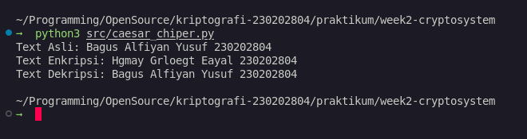
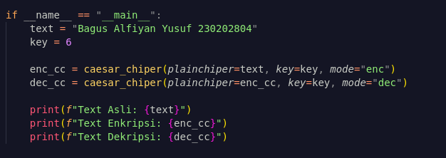

# Laporan Praktikum Kriptografi
Minggu ke-: 2  
Topik: Impelentasi Algoritma Caesar Chiper dan kriptosistem  
Nama: Bagus Alfiyan Yusuf  
NIM: 230202804 
Kelas: 5IKRA  

---

## 1. Tujuan
1. Mengidentifikasi komponen dasar kriptosistem (plaintext, ciphertext, kunci, algoritma).
2. Menggambarkan proses enkripsi dan dekripsi sederhana.
3. Mengklasifikasikan jenis kriptosistem (simetris dan asimetris).

---

## 2. Dasar Teori
Kriptosistem adalah sebuah sistem yang terdiri dari serangkaian komponen dan prosedur untuk mengamankan data melalui enkripsi dan dekripsi. Komponen utamanya meliputi **plaintext** (pesan asli), **ciphertext** (pesan terenkripsi), **kunci** (informasi rahasia untuk transformasi), dan **algoritma** (metode matematis untuk enkripsi/dekripsi).

Salah satu contoh algoritma kriptografi klasik adalah Caesar Cipher. Algoritma ini termasuk dalam kategori *substitution cipher*, di mana setiap huruf dalam plaintext digantikan oleh huruf lain yang memiliki posisi tetap dalam alfabet. Jarak pergeseran huruf ditentukan oleh sebuah kunci numerik. Proses dekripsi dilakukan dengan menggeser huruf ke arah sebaliknya menggunakan kunci yang sama.

---

## 3. Alat dan Bahan
- Python 3.x  
- Visual Studio Code / editor lain  
- Git dan akun GitHub  

---

## 4. Langkah Percobaan
1. Membuat struktur direktori `praktikum/week2-cryptosystem/` yang berisi folder `src`, `screenshots`, dan file `laporan.md`.
2. Membuat diagram yang mengilustrasikan alur kerja kriptosistem dan menyimpannya di `screenshots/diagram_kriptosistem.png`.
3. Mengimplementasikan algoritma Caesar Cipher dalam file Python `src/caesar_chiper.py`.
4. Menjalankan program untuk melakukan enkripsi dan dekripsi pada sebuah teks yang berisi nama dan NIM.
5. Mengambil screenshot hasil eksekusi program dan menyimpannya di folder `screenshots/`.
6. Melengkapi `laporan.md` dengan penjelasan, diagram, source code, hasil percobaan, dan jawaban pertanyaan diskusi.
7. Melakukan commit ke repositori GitHub dengan pesan `week2-cryptosystem`.

#### Diagram Kriptosistem
**Ekripsi:**

**Dekripsi:**


### kriptosistem
#### Simetris
Simetris kriptosistem disebut juga algoritma kriptografi konvensional karena menggunakan satu key untuk enkrpsi dan dekripsi. kunci yang digunakan untuk enkripsi sama dengan kunci untuk dekrpsi. hal ini membuat kedua belah pihat harus memiliki kunci yang sama persis, jika tidak chipertext tidak akan bisa di buka.
Jika ada yang memiliki kunci selain pengirim dan penerima maka dia kaan bisa membuka juga dari chipertext. tapi masalahnya bukan bagaimana cara mengirim key agar tidak diketahui orang. masalah yang banyak terjadi adalah manajemen key. dikaranan seitap orang harus memilki key yang sama—bayangkan jika mengirim sebuah pesan menggunakan algoritma simtetris ini ke 100 orang. pengirim harus memiliki key 100 yang berbeda. hal ini sangat merepotkan.
Tapi sistem ini memiliki sebuah unggulan dalam kecepatan. karena hanya perlu membutuhkan satu key untuk membuka chipertext membuat peroses semakin cepat. kecepatan dekripsi tergantung pada ukuran file juga. semakin besar file semakin lama juga proses dekripsinya.
**Contoh Algoritma: RES (Advanced Encryption Standard)**
AES adalah standar enkripsi global yang digunakan secara luas. Algoritma ini merupakan *block cipher* yang beroperasi pada blok data berukuran 128 bit. AES mendukung panjang kunci 128, 192, atau 256 bit. Proses enkripsinya terdiri dari beberapa putaran (ronde) transformasi matematis yang kompleks, seperti substitusi, permutasi, dan pencampuran kolom. Jumlah putaran tergantung pada panjang kunci (misalnya, 10 putaran untuk kunci 128-bit). Karena efisiensi dan keamanannya yang terbukti, AES menjadi pilihan utama untuk mengamankan data dalam berbagai aplikasi.
Contoh algoritma simetris lainnya: **DES, 3DES, RC4**.

#### Asimetris
Sistem ini adalah kroptografi yang memanfatkan beberapa key agar proses enkripsi dan dekripsi. asimetris ini adalah sebuah pasangan kunci kunci kriprografi yang dipergunakan untuk proses enkripsi dan yang satunya digunaka untuk dekripsi. dengan artian sistem ini memiliki privat key dan public key. orang yang memiliki public key dapat mengenkripsi paintext. yang hanya dapat dekrpsi hanya orang yang memiliki privat key.
Menggunakan metode ini cenderung lebih lambat dikarenakan proses enkripsi perlu piblic key dan proses dekrpsi hanya bisa dilakukan orang yang memiliki privat key. tapi pososes ini yang menutuku keren. karena perlu memiliki dua key untuk prosesnya.
aku membaca sebuah jurnal proses asimetris biasanya proses enkripsi key dari metode simetris. karena metode ini lambat maka yang enkripsi key dari metode simetris.
**Contoh Algiritma: RSA (Rivest-Shamir-Adleman)**
RSA adalah salah satu algoritma asimetris pertama dan paling terkenal. Keamanannya didasarkan pada kesulitan matematis untuk memfaktorkan bilangan besar yang merupakan hasil perkalian dua bilangan prima rahasia. Prosesnya secara sederhana adalah: kunci publik digunakan untuk mengenkripsi data dengan operasi eksponensial, dan kunci privat digunakan untuk mendekripsi dengan operasi eksponensial yang berbeda. Siapapun dapat mengenkripsi dengan kunci publik, tetapi hanya pemilik kunci privat yang dapat membalikkan prosesnya.
Contoh algoritma asimetris lainnya: **ECC (Elliptic Curve Cryptography), DSA**.

---

## 5. Source Code
(Salin kode program utama yang dibuat atau dimodifikasi.  
Gunakan blok kode:

```python
def caesar_chiper(plainchiper: str, key: int, mode: str) -> str:
    """
    parameter:
        plainchiper: input plaintext or chipertext
        key: pergeseran yang diingikan
        mode: "enc" enkripsi, "dec" dekripssi
    """
    if mode not in ("enc", "dec"):
        raise ValueError("Mode harus 'enc' atau 'dec'")

    result = ""
    key = key if mode == "enc" else (-key if mode == "dec" else key)
    for char in plainchiper:
        if char.isalpha():
            shift = 65 if char.isupper() else 97
            result += chr((ord(char) - shift + key) % 26 + shift)
        else:
            result += char
    return result


if __name__ == "__main__":
    text = "Bagus Alfiyan Yusuf 230202804"
    key = 6

    enc_cc = caesar_chiper(plainchiper=text, key=key, mode="enc")
    dec_cc = caesar_chiper(plainchiper=enc_cc, key=key, mode="dec")

    print(f"Text Asli: {text}")
    print(f"Text Enkripsi: {enc_cc}")
    print(f"Text Dekripsi: {dec_cc}")
```

---

## 6. Hasil dan Pembahasan

Hasil eksekusi program adalah sebagai berikut:
- **Plaintext**: `Bagus Alfiyan Yusuf 230202804`
- **Ciphertext (Hasil Enkripsi)**: `Hgmya Gnrpcgt Cayzn 230202804`
- **Hasil Dekripsi**: `Bagus Alfiyan Yusuf 230202804`

Hasil ini sesuai dengan ekspektasi. Program berhasil mengubah plaintext menjadi ciphertext yang tidak dapat dibaca, dan kemudian mengembalikannya ke bentuk semula dengan proses dekripsi. Karakter angka dan spasi tidak berubah karena logika program hanya memproses karakter alfabet.



Input:



---

## 7. Jawaban Pertanyaan
**1. Sebutkan komponen utama dalam sebuah kriptosistem.**
   - **Plaintext**: Pesan asli yang dapat dibaca.
   - **Ciphertext**: Pesan terenkripsi hasil dari proses enkripsi.
   - **Kunci (Key)**: Informasi rahasia yang digunakan untuk mengontrol algoritma enkripsi dan dekripsi.
   - **Algoritma (Cipher)**: Aturan atau fungsi matematis yang digunakan untuk transformasi data.
   - **Enkripsi & Dekripsi**: Proses transformasi dari plaintext ke ciphertext dan sebaliknya.

**2. Apa kelebihan dan kelemahan sistem simetris dibandingkan asimetris?**
   - **Sistem Simetris:**
     - **Kelebihan**: Proses enkripsi/dekripsi sangat cepat.
     - **Kelemahan**: Sulit dalam distribusi kunci yang aman dan manajemen kunci yang rumit untuk skala besar.
   - **Sistem Asimetris:**
     - **Kelebihan**: Memecahkan masalah distribusi kunci dan menyediakan otentikasi yang lebih baik.
     - **Kelemahan**: Proses komputasi jauh lebih lambat dan memakan lebih banyak sumber daya.

**3. Mengapa distribusi kunci menjadi masalah utama dalam kriptografi simetris?**
   Karena kunci yang sama digunakan untuk enkripsi dan dekripsi, kunci tersebut harus dikirim dari pengirim ke penerima melalui sebuah kanal yang aman. Jika kanal tersebut tidak aman dan kunci berhasil disadap oleh pihak ketiga, maka seluruh kerahasiaan pesan akan hilang karena pihak ketiga tersebut dapat mendekripsi semua pesan yang dikirim.

---

## 8. Kesimpulan
Praktikum ini berhasil mengimplementasikan algoritma Caesar Cipher sebagai contoh kriptosistem simetris sederhana. Dari percobaan, dapat disimpulkan bahwa sebuah kriptosistem terdiri dari komponen-komponen kunci seperti plaintext, ciphertext, algoritma, dan kunci. Selain itu, dipahami pula perbedaan mendasar antara kriptografi simetris yang cepat namun memiliki tantangan distribusi kunci, dengan kriptografi asimetris yang lebih lambat namun lebih aman dalam hal manajemen kunci.

---

## 9. Daftar Pustaka

- Basri *KRIPTOGRAFI SIMETRIS DAN ASIMETRIS DALAM PERSPEKTIF KEAMANAN DATA DAN KOMPLEKSITAS KOMPUTASI*

---

## 10. Commit Log
(Tuliskan bukti commit Git yang relevan.  
Contoh:
```
commit -
Author: Bagus Alfiyan Yusuf <bagusalfiyanyusuf@gmail.com>
Date:   2025-19-13

    week2-cryptosystem: implementasi Caesar Cipher dan laporan
```
