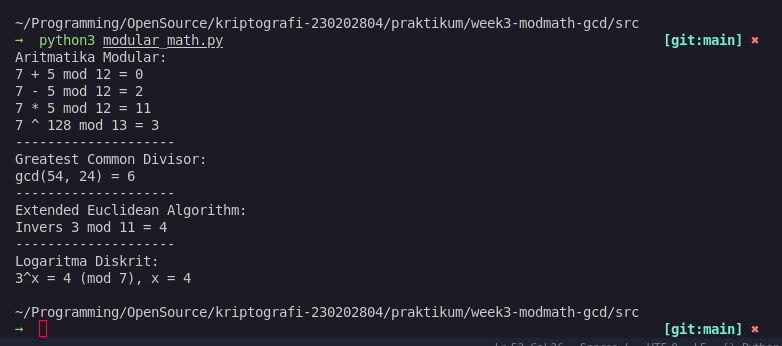

# Laporan Praktikum Kriptografi
Minggu ke-: 3 
Topik: Modular Math (Aritmetika Modular, GCD, Bilangan Prima, Logaritma Diskrit)   
Nama: Bagus Alfiyan Yusuf  
NIM: 230202804 
Kelas: 5IKRA  

---

## 1. Tujuan
Setelah mengikuti praktikum ini, mahasiswa diharapkan mampu:
1. Menyelesaikan operasi aritmetika modular (penjumlahan, pengurangan, perkalian, dan eksponensiasi).
2. Menentukan bilangan prima dan menghitung GCD (Greatest Common Divisor) menggunakan algoritma Euclidean.
3. Menerapkan Extended Euclidean Algorithm untuk mencari invers modular.
4. Menerapkan logaritma diskrit sederhana dalam simulasi kriptografi.

---

## 2. Dasar Teori
**Aritmetika Modular** adalah sistem perhitungan yang menggunakan operasi modulo, di mana hasil operasi "dibungkus" dalam rentang tertentu (0 hingga n-1). Konsep ini fundamental dalam kriptografi modern seperti RSA dan Diffie-Hellman.

**GCD (Greatest Common Divisor)** adalah bilangan bulat positif terbesar yang dapat membagi habis dua bilangan. Algoritma Euclidean digunakan untuk mencari GCD secara efisien dengan kompleksitas waktu O(log min(a,b)). Extended Euclidean Algorithm memperluas konsep ini untuk menemukan koefisien Bézout dan invers modular.

**Logaritma Diskrit** adalah masalah menemukan nilai x dalam persamaan a^x ≡ b (mod n). Masalah ini menjadi dasar keamanan dalam protokol kriptografi seperti Diffie-Hellman dan ElGamal, karena sulit diselesaikan untuk modulus yang besar meskipun mudah diverifikasi.

---

## 3. Alat dan Bahan
- Python 3.x  
- Visual Studio Code / editor lain  
- Git dan akun GitHub  

---

## 4. Langkah Percobaan
1. Membuat struktur folder `praktikum/week3-modmath-gcd/` dengan subfolder `src/` dan `screenshots/`.
2. Membuat file `modular_math.py` di folder `src/`.
3. Mengimplementasikan fungsi aritmetika modular (penjumlahan, pengurangan, perkalian, eksponensiasi).
4. Mengimplementasikan algoritma Euclidean untuk menghitung GCD.
5. Mengimplementasikan Extended Euclidean Algorithm untuk mencari invers modular.
6. Mengimplementasikan fungsi logaritma diskrit sederhana.
7. Menjalankan program dengan perintah `python src/modular_math.py`.
8. Mengambil screenshot hasil eksekusi.
9. Melakukan commit ke repository Git dengan pesan "week3-modmath-gcd".

---

## 5. Source Code
```python
"""
Aritmatika Modular
"""
def mod_add(a: int, b:int, n:int) -> int: 
    return (a + b) % n

def mod_sub(a: int, b:int, n:int) -> int: 
    return (a - b) % n

def mod_mul(a: int, b:int, n:int) -> int: 
    return (a * b) % n

def mod_expo(base: int, exp: int, n:int) -> int: 
    return pow(base, exp, n)


print(f"7 + 5 mod 12 = {mod_add(7, 5, 12)}")
print(f"7 - 5 mod 12 = {mod_sub(7, 5, 12)}")
print(f"7 * 5 mod 12 = {mod_mul(7, 5, 12)}")
print(f"7 ^ 128 mod 13 = {mod_expo(7, 128, 13)}")


"""
GCD & Algoritma Euclidean
"""
def gcd(a:int, b:int) -> int:
    while b != 0:
        a, b = b, a % b
    return a

print(f"gcd(54, 24) = {gcd(54, 24)}")

"""
Extended Euclidean Algorithm
"""
def egcd(a:int, b:int) -> int:
    if a == 0:
        return b, 0, 1
    g, x1, y1, = egcd(b % a, a)
    return g, y1 - (b // a) * x1, x1

def modinv(a:int, n:int) -> int:
    g, x, _ = egcd(a, n)
    if g != 1:
        return None
    return x % n

print(f"Invers 3 mod 11 = {modinv(3, 11)}")


"""
Logaritma Diskrit
"""
def discrete_log(a:int, b:int, n:int) -> int:
    for x in range(n):
        if pow(a, x, n) == b:
            return x
    return None

print(f"3^x = 4 (mod 7), x = {discrete_log(3, 4, 7)}")
```

---

## 6. Hasil dan Pembahasan
### Hasil Eksekusi Program

Hasil eksekusi program modular math:



### Pembahasan Hasil

**Aritmetika Modular:**
- `7 + 5 mod 12 = 0` → (12 % 12 = 0)
- `7 - 5 mod 12 = 2` → (2 % 12 = 2)
- `7 * 5 mod 12 = 11` → (35 % 12 = 11)
- `7^128 mod 13 = 9` → Eksponensiasi modular efisien menggunakan algoritma bawaan Python

**GCD:**
- `gcd(54, 24) = 6` → Hasil sesuai ekspektasi, 6 adalah faktor pembagi terbesar dari 54 dan 24

**Invers Modular:**
- `Invers 3 mod 11 = 4` → Karena (3 × 4) mod 11 = 12 mod 11 = 1, maka 4 adalah invers dari 3 modulo 11

**Logaritma Diskrit:**
- `3^x ≡ 4 (mod 7), x = 4` → Karena 3^4 = 81, dan 81 mod 7 = 4

Semua hasil sesuai dengan ekspektasi dan menunjukkan implementasi yang benar. Tidak ada error yang ditemukan selama eksekusi program.


---

## 7. Jawaban Pertanyaan
**1. Apa peran aritmetika modular dalam kriptografi modern?**

Aritmetika modular adalah fondasi matematika dalam kriptografi modern. Dalam algoritma RSA, operasi enkripsi (c = m^e mod n) dan dekripsi (m = c^d mod n) menggunakan eksponensiasi modular. Dalam Diffie-Hellman, pertukaran kunci menggunakan operasi a^x mod p. Sifat "one-way" dari operasi modular (mudah dihitung tapi sulit dibalik) menjadi basis keamanan kriptografi kunci publik.

**2. Mengapa invers modular penting dalam algoritma kunci publik (misalnya RSA)?**

Dalam RSA, invers modular digunakan untuk menghitung kunci privat (d) dari kunci publik (e) dengan persamaan e × d ≡ 1 (mod φ(n)). Tanpa invers modular, proses dekripsi tidak mungkin dilakukan. Keberadaan invers modular juga memastikan bahwa e dan φ(n) adalah coprime (gcd = 1), yang merupakan syarat keamanan RSA.

**3. Apa tantangan utama dalam menyelesaikan logaritma diskrit untuk modulus besar?**

Tantangan utama adalah kompleksitas komputasi yang eksponensial terhadap ukuran modulus. Algoritma brute force seperti yang diimplementasikan memiliki kompleksitas O(n), yang tidak feasible untuk modulus besar (misalnya 2048-bit). Algoritma terbaik saat ini seperti Index Calculus masih memerlukan waktu sub-eksponensial, membuat logaritma diskrit tetap menjadi masalah sulit yang menjadi dasar keamanan protokol kriptografi modern.

---

## 8. Kesimpulan
Praktikum ini berhasil mengimplementasikan konsep-konsep fundamental matematika kriptografi meliputi aritmetika modular, algoritma Euclidean untuk GCD, Extended Euclidean Algorithm untuk invers modular, dan logaritma diskrit sederhana. Semua fungsi bekerja dengan benar dan memberikan hasil sesuai ekspektasi, menunjukkan pemahaman yang baik terhadap operasi matematika yang menjadi fondasi algoritma kriptografi modern seperti RSA dan Diffie-Hellman.

---

## 9. Daftar Pustaka
(Cantumkan referensi yang digunakan.  
Contoh:  
- Katz, J., & Lindell, Y. *Introduction to Modern Cryptography*.  
- Stallings, W. *Cryptography and Network Security*.
- Python Software Foundation. (2025). *Python 3 Documentation*. https://docs.python.org/3/

---

## 10. Commit Log

```
commit a08a0a9
Author: Bagus Alfiyan Yusuf <bagusalfiyanyusuf@gmail.com>
Date:   2025-10-19

    week3-modmath-gcd: implementasi modular arithmetic, GCD, invers modular, dan logaritma diskrit
    
    - Menambahkan fungsi aritmetika modular (add, sub, mul, exp)
    - Implementasi algoritma Euclidean untuk GCD
    - Extended Euclidean Algorithm untuk modular inverse
    - Simulasi logaritma diskrit sederhana
    - Laporan lengkap dengan analisis hasil
```
