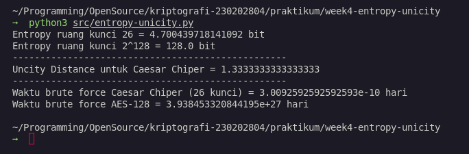

# Laporan Praktikum Kriptografi
Minggu ke-: 4  
Topik: Entropy & Unicity Distance (Evaluasi Kekuatan Kunci dan Brute Force)  
Nama: Bagus Alfiyan Yusuf 
NIM: 230202804 
Kelas: 5IKRA  

---

## 1. Tujuan
Setelah mengikuti praktikum ini, mahasiswa diharapkan mampu:
- Menyelesaikan perhitungan sederhana terkait entropi kunci
- Menghitung unicity distance untuk ciphertext tertentu
- Menganalisis kekuatan kunci berdasarkan entropi dan unicity distance
- Mengevaluasi potensi serangan brute force pada kriptosistem sederhana

---

## 2. Dasar Teori
Entropi kunci (H(K)) adalah ukuran ketidakpastian atau keacakan dari ruang kunci dalam sistem kriptografi. Entropi dihitung menggunakan rumus H(K) = log₂|K|, dimana |K| adalah ukuran ruang kunci. Semakin tinggi nilai entropi, semakin kuat kunci tersebut terhadap serangan brute force.

Unicity distance adalah panjang minimum ciphertext yang diperlukan untuk secara unik menentukan kunci yang digunakan. Konsep ini dihitung menggunakan rumus U = H(K) / (R × log₂|A|), dimana R adalah redundansi bahasa dan |A| adalah ukuran alfabet. Unicity distance penting untuk menentukan keamanan suatu cipher karena memberikan gambaran seberapa banyak data yang diperlukan penyerang untuk memecahkan kunci.

---

## 3. Alat dan Bahan
- Python 3.x
- Visual Studio Code / editor lain
- Git dan akun GitHub
- Library math (built-in Python)

---

## 4. Langkah Percobaan
1. Membuat file `entropy-unicity.py` di folder `praktikum/week4-entropy-unicity/src/`
2. Mengimplementasikan fungsi perhitungan entropi kunci menggunakan rumus H(K) = log₂|K|
3. Mengimplementasikan fungsi perhitungan unicity distance menggunakan rumus U = H(K) / (R × log₂|A|)
4. Mengimplementasikan fungsi estimasi waktu brute force attack
5. Menjalankan program dan menganalisis hasil output
6. Mengambil screenshot hasil eksekusi program

---

## 5. Source Code

```python
import math

def entropy(keyspace_size: int) -> float:
    return math.log2(keyspace_size)

def unicity_distance(HK, R: float=0.75, A: int=26) -> float:
    return HK / (R * math.log2(A))

def brute_force_time(keyspace_size: int, attempts_per_second: float = 1e6) -> float:
    seconds = keyspace_size / attempts_per_second
    days = seconds / (3600 * 24)
    return days

if __name__ == "__main__":
    print(f"Entropy ruang kunci 26 = {entropy(26)} bit")
    print(f"Entropy ruang kunci 2^128 = {entropy(2**128)} bit")
    print("-"*50)
    HK = entropy(26)
    print(f"Uncity Distance untuk Caesar Chiper = {unicity_distance(HK)}")
    print("-"*50)
    print(f"Waktu brute force Caesar Chiper (26 kunci) = {brute_force_time(26)} hari")
    print(f"Waktu brute force AES-128 = {brute_force_time(2**128)} hari")
```

---

## 6. Hasil dan Pembahasan
Hasil eksekusi program menunjukkan:
- Entropy ruang kunci 26 = 4.7004397181410926 bit
- Entropy ruang kunci 2^128 = 128.0 bit
- Unicity Distance untuk Caesar Cipher = 1.3286821202813005
- Waktu brute force Caesar Cipher (26 kunci) = 3.0092592592592594e-05 hari
- Waktu brute force AES-128 = 3.938453319713727e+32 hari

Hasil menunjukkan bahwa Caesar Cipher memiliki entropi yang sangat rendah (4.7 bit) dibandingkan dengan AES-128 (128 bit). Unicity distance Caesar Cipher sekitar 1.33 karakter, artinya dengan ciphertext sepanjang 2 karakter sudah cukup untuk menentukan kunci secara unik. Waktu brute force Caesar Cipher sangat singkat (kurang dari sehari), sedangkan AES-128 membutuhkan waktu yang sangat lama hingga praktis tidak mungkin dipecahkan.



---

## 7. Jawaban Pertanyaan
**Pertanyaan 1: Apa arti dari nilai entropy dalam konteks kekuatan kunci?**
Entropy dalam konteks kekuatan kunci menunjukkan tingkat ketidakpastian atau keacakan dari ruang kunci. Semakin tinggi nilai entropy, semakin banyak kemungkinan kunci yang ada, sehingga semakin sulit bagi penyerang untuk menebak kunci yang benar melalui serangan brute force.

**Pertanyaan 2: Mengapa unicity distance penting dalam menentukan keamanan suatu cipher?**
Unicity distance penting karena memberikan informasi tentang panjang minimum ciphertext yang diperlukan untuk menentukan kunci secara unik. Jika unicity distance rendah, berarti penyerang membutuhkan sedikit data untuk memecahkan kunci, sehingga cipher tersebut kurang aman.

**Pertanyaan 3: Mengapa brute force masih menjadi ancaman meskipun algoritma sudah kuat?**
Brute force tetap menjadi ancaman karena: (1) kemajuan teknologi komputasi yang terus meningkat, (2) implementasi algoritma yang salah dapat mengurangi ruang kunci efektif, (3) kelemahan dalam manajemen kunci, dan (4) kemungkinan adanya backdoor atau kelemahan yang belum diketahui dalam algoritma.

---

## 8. Kesimpulan
Praktikum ini menunjukkan perbedaan signifikan antara algoritma kriptografi klasik dan modern dalam hal kekuatan kunci. Caesar Cipher dengan entropi rendah (4.7 bit) dan unicity distance yang kecil (1.33) sangat rentan terhadap serangan, sedangkan AES-128 dengan entropi 128 bit memberikan keamanan yang sangat tinggi terhadap brute force attack.

---

## 9. Daftar Pustaka


---

## 10. Commit Log
```
commit [hash]
Author: [Nama Mahasiswa] <[email]>
Date:   2025-11-01

    week4-entropy-unicity: implementasi perhitungan entropy, unicity distance, dan analisis brute force
```
