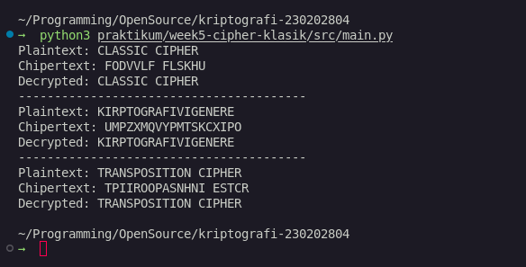

# Laporan Praktikum Kriptografi
Minggu ke-: 5  
Topik: Cipher Klasik (Caesar, Vigenère, Transposisi)  
Nama: Bagus Alfiyan Yusuf
NIM: 230202804
Kelas: 5IKRA  

---

## 1. Tujuan
Setelah mengikuti praktikum ini, mahasiswa diharapkan mampu:
1. Menerapkan algoritma **Caesar Cipher** untuk enkripsi dan dekripsi teks.
2. Menerapkan algoritma **Vigenère Cipher** dengan variasi kunci.
3. Mengimplementasikan algoritma transposisi sederhana.
4. Menjelaskan kelemahan algoritma kriptografi klasik.

---

## 2. Dasar Teori
Cipher klasik merupakan metode kriptografi tradisional yang digunakan sebelum era komputer modern. Caesar Cipher adalah teknik substitusi sederhana di mana setiap huruf dalam plaintext diganti dengan huruf lain yang berada pada posisi tetap dalam alfabet. Vigenère Cipher menggunakan kata kunci berulang untuk melakukan substitusi, sehingga setiap huruf yang sama dalam plaintext dapat menghasilkan ciphertext yang berbeda tergantung posisinya.

Cipher transposisi bekerja dengan cara mengatur ulang posisi karakter dalam plaintext tanpa mengubah karakter itu sendiri. Meskipun cipher klasik mudah dipahami dan diimplementasikan, mereka memiliki kelemahan signifikan terhadap serangan analisis frekuensi dan teknik kriptanalisis modern. Pemahaman tentang cipher klasik penting sebagai dasar untuk memahami evolusi kriptografi modern.

---

## 3. Alat dan Bahan
- Python 3.x
- Visual Studio Code / editor lain
- Git dan akun GitHub
- Modul kriptografi custom (caesar_chiper, vigenere_chiper, transpose)

---

## 4. Langkah Percobaan
1. Membuat folder struktur `praktikum/week5-cipher-klasik/src/` dan `screenshots/`.
2. Mengimplementasikan modul Caesar Cipher dalam file `moduls/caesar_chiper.py`.
3. Mengimplementasikan modul Vigenère Cipher dalam file `moduls/vigenere_chiper.py`.
4. Mengimplementasikan modul Transposisi dalam file `moduls/transpose.py`.
5. Membuat file `main.py` untuk menjalankan dan menguji semua implementasi cipher.
6. Menjalankan program dengan perintah `python main.py`.
7. Mengambil screenshot hasil eksekusi program.

---

## 5. Source Code
**src/moduls/caesar_chiper.py**
```python
def encrypt(plaintext: str, key: int) -> str:
    result = ""
    for char in plaintext:
        if char.isalpha():
            shift = 65 if char.isupper() else 97
            result += chr((ord(char) - shift + key) % 26 + shift)
        else:
            result += char

    return result

def decrypt(chipertext: str, key: int) -> str:
    return encrypt(chipertext, -key)

```

**src/moduls/vigenere_chiper.py**
```python
def encrypt(plaintext: str, key: int) -> str:
    result = []
    key = key.lower()
    key_index = 0
    for char in plaintext:
        if char.isalpha:
            shift = ord(key[key_index % len(key)]) - 97
            base = 65 if char.isupper() else 97
            result.append(chr((ord(char) - base + shift) % 26 + base))
            key_index += 1
        else:
            result.append(char)

    return "".join(result)


def decrypt(chipertext: str, key: int) -> str:
    result = []
    key = key.lower()
    key_index = 0
    for char in chipertext:
        if char.isalpha:
            shift = ord(key[key_index % len(key)]) - 97
            base = 65 if char.isupper() else 97
            result.append(chr((ord(char) - base - shift) % 26 + base))
            key_index += 1
        else:
            result.append(char)

    return "".join(result)

```

**src/moduls/transpose.py**
```python
def encrypt(plaintext: str, key: int) -> str:
    chipertext = [''] * key
    for col in range(key):
        pointer = col
        while pointer < len(plaintext):
            chipertext[col] += plaintext[pointer]
            pointer += key
    return "".join(chipertext)

def decrypt(chipertext: str, key: int) -> str:
    num_of_cols = int(len(chipertext) / key + 0.9999)
    num_of_rows = key
    num_of_shaded_boxes = (num_of_cols * num_of_rows) - len(chipertext)
    plaintext = [""] * num_of_cols
    col = 0
    row = 0
    
    for symbol in chipertext:
        plaintext[col] += symbol
        col += 1
        if (col == num_of_cols) or (col == num_of_cols - 1 and row >= num_of_rows - num_of_shaded_boxes):
            col = 0
            row += 1
    return "".join(plaintext)
```

**src/main.py**
```python
from moduls import caesar_chiper, vigenere_chiper, transpose

def caesar() -> None:
    msg = "CLASSIC CIPHER"
    key = 3
    enc = caesar_chiper.encrypt(msg, key)
    dec = caesar_chiper.decrypt(enc, key)

    print(f"Plaintext: {msg}")
    print(f"Chipertext: {enc}")
    print(f"Decrypted: {dec}")

def vigenere() -> None:
    msg = "KIRPTOGRAFIVIGENERE"
    key = "KEY"
    enc = vigenere_chiper.encrypt(plaintext=msg, key=key)
    dec = vigenere_chiper.decrypt(chipertext=enc, key=key)

    print(f"Plaintext: {msg}")
    print(f"Chipertext: {enc}")
    print(f"Decrypted: {dec}")

def transpose_metod() -> None:
    msg = "TRANSPOSITION CIPHER"
    enc = transpose.encrypt(msg, key=5)
    dec = transpose.decrypt(enc, key=5)

    print(f"Plaintext: {msg}")
    print(f"Chipertext: {enc}")
    print(f"Decrypted: {dec}")

if __name__ == "__main__":
    caesar()
    print('-'*40)
    vigenere()
    print('-'*40)
    transpose_metod()
```

---

## 6. Hasil dan Pembahasan

Hasil eksekusi program menunjukkan implementasi yang berhasil untuk ketiga algoritma cipher klasik:

**Caesar Cipher:**
- Plaintext: "CLASSIC CIPHER"
- Key: 3
- Berhasil melakukan enkripsi dan dekripsi dengan pergeseran 3 posisi

**Vigenère Cipher:**
- Plaintext: "KIRPTOGRAFIVIGENERE"
- Key: "KEY"
- Menggunakan kata kunci berulang untuk enkripsi yang lebih kompleks

**Transposisi Cipher:**
- Plaintext: "TRANSPOSITION CIPHER"
- Key: 5
- Mengatur ulang posisi karakter berdasarkan kolom dengan lebar 5

Program berhasil menjalankan enkripsi dan dekripsi untuk semua algoritma tanpa error. Hasil dekripsi mengembalikan plaintext asli, menunjukkan implementasi yang benar.



---

## 7. Jawaban Pertanyaan

**Pertanyaan 1: Apa kelemahan utama algoritma Caesar Cipher dan Vigenère Cipher?**
- Caesar Cipher: Hanya memiliki 25 kemungkinan kunci, sehingga mudah dipecahkan dengan brute force attack. Juga rentan terhadap analisis frekuensi karena pola substitusi yang konsisten.
- Vigenère Cipher: Meskipun lebih kuat dari Caesar, tetap rentan terhadap analisis Kasiski dan analisis indeks kebetulan jika panjang kunci diketahui atau dapat ditebak.

**Pertanyaan 2: Mengapa cipher klasik mudah diserang dengan analisis frekuensi?**
Cipher klasik mempertahankan karakteristik statistik bahasa asli. Dalam bahasa Indonesia/Inggris, huruf tertentu (seperti 'E', 'A', 'I') muncul lebih sering. Analisis frekuensi dapat mengidentifikasi pola ini dalam ciphertext untuk memecahkan enkripsi.

**Pertanyaan 3: Bandingkan kelebihan dan kelemahan cipher substitusi vs transposisi.**
- Cipher Substitusi: Kelebihan - mudah implementasi, cepat. Kelemahan - rentan analisis frekuensi, pola bahasa tetap terjaga.
- Cipher Transposisi: Kelebihan - mengacak posisi karakter, sulit analisis frekuensi sederhana. Kelemahan - struktur kata masih terlihat, rentan terhadap analisis pola transposisi.

---

## 8. Kesimpulan

Praktikum ini berhasil mengimplementasikan tiga algoritma cipher klasik: Caesar, Vigenère, dan Transposisi. Semua algoritma bekerja dengan benar untuk enkripsi dan dekripsi. Cipher klasik memberikan pemahaman dasar tentang konsep kriptografi, namun memiliki kelemahan signifikan dalam keamanan modern sehingga tidak cocok untuk aplikasi yang memerlukan keamanan tinggi.

---

## 9. Daftar Pustaka

- Stallings, W. *Cryptography and Network Security: Principles and Practice*. 7th Edition.
- Katz, J., & Lindell, Y. *Introduction to Modern Cryptography*. 2nd Edition.
- Dokumentasi Praktikum Kriptografi - 05 Cipher Klasik.

---

## 10. Commit Log

```
commit 45d903d
Author: Bagus Alfiyan Yusuf [bagusalfiyanyusuf@gmail.com]
Date:   2025-11-02

    week5-cipher-klasik: implementasi Caesar, Vigenère, dan Transposisi Cipher

    - Tambah modul caesar_chiper.py untuk Caesar Cipher
    - Tambah modul vigenere_chiper.py untuk Vigenère Cipher  
    - Tambah modul transpose.py untuk Transposisi Cipher
    - Tambah main.py untuk testing semua implementasi
    - Tambah laporan.md dengan hasil percobaan
```
