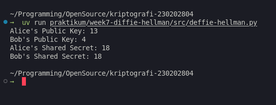

# Laporan Praktikum Kriptografi
Minggu ke-: 7  
Topik: Diffie-Hellman Key Exchange  
Nama: Bagus Alfiyan Yusuf  
NIM: 230202804
Kelas: 5IKRA  

---

## 1. Tujuan
Setelah mengikuti praktikum ini, mahasiswa diharapkan mampu:
1. Melakukan simulasi protokol **Diffie-Hellman** untuk pertukaran kunci publik.
2. Menjelaskan mekanisme pertukaran kunci rahasia menggunakan bilangan prima dan logaritma diskrit.
3. Menganalisis potensi serangan pada protokol Diffie-Hellman (termasuk serangan **Man-in-the-Middle / MITM**).

---

## 2. Dasar Teori

### 2.1 Konsep Dasar
Diffie-Hellman Key Exchange adalah protokol kriptografi yang memungkinkan dua pihak untuk membuat kunci rahasia bersama melalui saluran komunikasi publik yang tidak aman. Protokol ini ditemukan oleh Whitfield Diffie dan Martin Hellman pada tahun 1976 dan menjadi dasar bagi banyak protokol keamanan modern seperti TLS/SSL.

### 2.2 Mekanisme Matematis
Protokol ini bekerja berdasarkan kesulitan matematis dalam memecahkan masalah logaritma diskrit. Langkah-langkahnya sebagai berikut:

1. **Parameter Publik**: Alice dan Bob menyepakati bilangan prima besar $p$ dan generator $g$ secara publik.

2. **Pembangkitan Kunci Privat**: 
   - Alice memilih kunci privat acak $a$ dimana $1 < a < p$
   - Bob memilih kunci privat acak $b$ dimana $1 < b < p$

3. **Perhitungan Kunci Publik**:
   - Alice menghitung: $A = g^a \bmod p$
   - Bob menghitung: $B = g^b \bmod p$

4. **Pertukaran Kunci Publik**: Alice mengirim $A$ ke Bob, dan Bob mengirim $B$ ke Alice melalui saluran publik.

5. **Perhitungan Shared Secret**:
   - Alice menghitung: $s_A = B^a \bmod p = (g^b)^a \bmod p = g^{ab} \bmod p$
   - Bob menghitung: $s_B = A^b \bmod p = (g^a)^b \bmod p = g^{ab} \bmod p$

6. **Verifikasi**: Kedua pihak memiliki shared secret yang sama: $s_A = s_B = g^{ab} \bmod p$

### 2.3 Keamanan
Keamanan protokol bergantung pada **Discrete Logarithm Problem (DLP)**: Diberikan $g$, $p$, dan $A = g^a \bmod p$, sangat sulit secara komputasional untuk menemukan nilai $a$.

Meskipun Diffie-Hellman aman terhadap penyadapan pasif, protokol ini rentan terhadap serangan Man-in-the-Middle (MITM) jika tidak dikombinasikan dengan mekanisme autentikasi. Dalam serangan MITM, penyerang dapat mencegat dan memodifikasi kunci publik yang dipertukarkan, sehingga dapat mendekripsi komunikasi.

---

## 3. Alat dan Bahan
- Python 3.x
- Visual Studio Code / editor lain
- Git dan akun GitHub
- Library `random` (built-in Python)

---

## 4. Langkah Percobaan
1. Membuat folder struktur `praktikum/week7-diffie-hellman/src/` dan `screenshots/`.
2. Mengimplementasikan class `DiffieHellman` dalam file `src/deffie-hellman.py`.
3. Membuat implementasi dengan parameter publik ($p=23$, $g=5$).
4. Menggunakan private key yang sudah ditentukan untuk Alice ($a=92378234$) dan Bob ($b=23482342$).
5. Menjalankan simulasi pertukaran kunci dan menghitung shared secret.
6. Memverifikasi bahwa shared secret Alice dan Bob sama.
7. Menjalankan program dengan perintah `python deffie-hellman.py`.
8. Mengambil screenshot hasil eksekusi program.

---

## 5. Source Code

```python
import random

class DiffieHellman:
    def __init__(
        self,
        p: int,
        g: int,
        name: str,
        private_key: int = None,
    ):
        self.p = p
        self.g = g
        self.name = name
        self.private_key = random.randint(1, p - 1) if private_key is None else private_key
        self.public_key = pow(g, self.private_key, p)
        self.shared_secret = None

    def compute_shared_secret(self, other_public_key: int):
        self.shared_secret = pow(other_public_key, self.private_key, self.p)
        return self.shared_secret


if __name__ == "__main__":
    p = 23  
    g = 5  

    A = 92378234
    B = 23482342

    # Alice's side
    alice = DiffieHellman(p, g, "Alice", private_key=A)
    print(f"Alice's Public Key: {alice.public_key}")

    # Bob's side
    bob = DiffieHellman(p, g, "Bob", private_key=B)
    print(f"Bob's Public Key: {bob.public_key}")

    # Compute shared secrets
    alice_shared_secret = alice.compute_shared_secret(bob.public_key)
    bob_shared_secret = bob.compute_shared_secret(alice.public_key)

    print(f"Alice's Shared Secret: {alice_shared_secret}")
    print(f"Bob's Shared Secret: {bob_shared_secret}")
    assert alice_shared_secret == bob_shared_secret, "Shared secrets do not match!"
```

---

## 6. Hasil dan Pembahasan

### 6.1 Hasil Eksekusi
Hasil eksekusi program menunjukkan implementasi protokol Diffie-Hellman yang berhasil:

**Parameter Publik:**
- Bilangan prima: $p = 23$
- Generator: $g = 5$

**Private Keys:**
- Alice: $a = 92378234 \equiv 6 \pmod{23}$
- Bob: $b = 23482342 \equiv 12 \pmod{23}$

**Perhitungan Kunci Publik:**
- Alice's Public Key: $A = g^a \bmod p = 5^6 \bmod 23 = 15625 \bmod 23 = 13$
- Bob's Public Key: $B = g^b \bmod p = 5^{12} \bmod 23 = 244140625 \bmod 23 = 7$

**Perhitungan Shared Secret:**
- Alice's Shared Secret: 
  $$s_A = B^a \bmod p = 7^6 \bmod 23 = 117649 \bmod 23 = 18$$
  
- Bob's Shared Secret: 
  $$s_B = A^b \bmod p = 13^{12} \bmod 23 = 23298085122481 \bmod 23 = 18$$

**Verifikasi:**
$$s_A = s_B = 18$$

Program berhasil memverifikasi bahwa kedua shared secret identik ($s_A = s_B = 18$), yang membuktikan protokol Diffie-Hellman berfungsi dengan benar. Assertion tidak menghasilkan error, menandakan kunci bersama berhasil dibuat tanpa pernah mengirimkan private key melalui jaringan.
**Output:**


### 6.2 Analisis Keamanan

Meskipun protokol ini aman terhadap penyadapan pasif, terdapat beberapa kelemahan:

#### 6.2.1 Man-in-the-Middle Attack (MITM)
Tanpa autentikasi, penyerang (Eve) dapat mencegat komunikasi:
- Eve mencegat $A$ dari Alice dan mengirim $A'$ ke Bob
- Eve mencegat $B$ dari Bob dan mengirim $B'$ ke Alice
- Eve menghitung dua shared secret: $s_{AE} = A^e \bmod p$ dan $s_{BE} = B^e \bmod p$
- Eve dapat mendekripsi semua komunikasi

#### 6.2.2 Small Subgroup Attack
Jika generator $g$ tidak dipilih dengan benar atau berada dalam subgrup kecil, penyerang dapat mengeksploitasi ini untuk mengurangi ruang pencarian kunci secara signifikan.

#### 6.2.3 Discrete Logarithm Problem
Keamanan bergantung pada kesulitan menghitung logaritma diskrit. Dengan bilangan prima yang terlalu kecil (seperti $p=23$ dalam contoh), brute force menjadi feasible. Dalam praktik, $p$ harus minimal 2048 bit untuk keamanan yang memadai.


---

## 7. Jawaban Pertanyaan

**Pertanyaan 1: Mengapa Diffie-Hellman memungkinkan pertukaran kunci di saluran publik?**

Diffie-Hellman memungkinkan pertukaran kunci di saluran publik karena menggunakan konsep matematika **one-way function** berbasis masalah logaritma diskrit. 

Meskipun public key ($A$ dan $B$) dikirim melalui saluran terbuka, sangat sulit secara komputasional untuk menghitung private key dari public key yang diketahui:
- Mudah menghitung: $A = g^a \bmod p$ (forward direction)
- Sangat sulit menghitung: $a$ dari $A, g, p$ (backward direction - Discrete Log Problem)

Prosesnya:
1. Alice mengirim $A = g^a \bmod p$
2. Bob mengirim $B = g^b \bmod p$
3. Penyerang mengetahui $g, p, A, B$ tetapi tidak dapat menghitung $a$ atau $b$
4. Alice menghitung: $s = B^a \bmod p = (g^b)^a \bmod p = g^{ab} \bmod p$
5. Bob menghitung: $s = A^b \bmod p = (g^a)^b \bmod p = g^{ab} \bmod p$

Kedua pihak mendapatkan shared secret yang sama: $s = g^{ab} \bmod p$

**Pertanyaan 2: Apa kelemahan utama protokol Diffie-Hellman murni?**

Kelemahan utama protokol Diffie-Hellman murni adalah:

1. **Rentan terhadap Man-in-the-Middle (MITM)**: Tidak ada mekanisme autentikasi bawaan untuk memverifikasi identitas pihak yang berkomunikasi. Penyerang dapat mencegat dan memodifikasi public key.

2. **Tidak memberikan autentikasi**: Protokol hanya menjamin kerahasiaan (confidentiality), bukan autentikasi atau integritas pesan. Alice tidak dapat memverifikasi bahwa dia berkomunikasi dengan Bob yang sebenarnya.

3. **Bergantung pada parameter yang kuat**: Keamanan sangat bergantung pada pemilihan:
   - Bilangan prima $p$ yang cukup besar (minimal 2048 bit)
   - Generator $g$ yang tepat
   - Private key yang benar-benar acak

4. **Computational cost**: Operasi modular exponentiation dengan bilangan besar memerlukan komputasi yang intensif.

5. **Tidak ada forward secrecy sempurna**: Jika private key terkompromikan, penyerang yang merekam komunikasi masa lalu dapat mendekripsinya.

**Pertanyaan 3: Bagaimana cara mencegah serangan MITM pada protokol ini?**

Beberapa cara untuk mencegah serangan MITM pada protokol Diffie-Hellman:

1. **Digital Signatures**: 
   - Menandatangani public key dengan private key dari sistem kriptografi asimetris (RSA/ECDSA)
   - Alice mengirim: $(A, \text{Sign}_{SK_A}(A))$
   - Bob memverifikasi dengan public key Alice: $\text{Verify}_{PK_A}(A, \text{signature})$

2. **Sertifikat Digital (PKI)**:
   - Menggunakan Public Key Infrastructure
   - Certificate Authority (CA) terpercaya menandatangani sertifikat
   - Sertifikat mengikat identitas dengan public key

3. **Pre-shared Keys (PSK)**:
   - Menggunakan kunci rahasia yang dibagikan sebelumnya melalui saluran aman
   - Menggunakan HMAC untuk autentikasi: $\text{HMAC}_{PSK}(A)$

4. **Station-to-Station (STS) Protocol**:
   - Variasi Diffie-Hellman dengan autentikasi
   - Menambahkan digital signature dan enkripsi pada pertukaran kunci
   - Formula: $E_s(\text{Sign}_{SK}(g^x, g^y))$

5. **Perfect Forward Secrecy (PFS)**:
   - Menggunakan **Ephemeral Diffie-Hellman (DHE/ECDHE)**
   - Menghasilkan pasangan kunci baru untuk setiap sesi
   - Kompromisasi satu kunci tidak mempengaruhi sesi lainnya

6. **Authenticated Diffie-Hellman**:
   - Mengkombinasikan dengan protokol autentikasi seperti HMAC
   - Formula verifikasi: $\text{HMAC}_k(A || B) = \text{HMAC}_k(g^a \bmod p || g^b \bmod p)$

---

## 8. Kesimpulan

Praktikum ini berhasil mengimplementasikan dan mensimulasikan protokol Diffie-Hellman Key Exchange menggunakan Python. Protokol memungkinkan Alice dan Bob untuk membuat kunci rahasia bersama ($s = 18$) melalui saluran publik tanpa mengirimkan kunci privat.

**Key Findings:**
- Shared secret berhasil dihitung: $s_A = s_B = g^{ab} \bmod p = 18$
- Protokol bekerja berdasarkan kesulitan Discrete Logarithm Problem
- Meskipun aman terhadap penyadapan pasif, protokol murni ini rentan terhadap serangan Man-in-the-Middle
- Implementasi praktis memerlukan mekanisme autentikasi tambahan seperti digital signatures, PKI, atau authenticated key exchange protocols

**Rekomendasi:**
1. Gunakan bilangan prima besar ($p \geq 2048$ bit) dalam implementasi produksi
2. Implementasikan mekanisme autentikasi (certificates, digital signatures)
3. Pertimbangkan penggunaan Elliptic Curve Diffie-Hellman (ECDH) untuk efisiensi lebih baik
4. Gunakan ephemeral keys untuk Perfect Forward Secrecy

---

## 9. Daftar Pustaka

- Stallings, W. (2017). *Cryptography and Network Security: Principles and Practice*. 7th Edition. Pearson.
- Diffie, W., & Hellman, M. (1976). *New Directions in Cryptography*. IEEE Transactions on Information Theory, 22(6), 644-654.
- Katz, J., & Lindell, Y. (2014). *Introduction to Modern Cryptography*. 2nd Edition. CRC Press.
- Menezes, A., van Oorschot, P., & Vanstone, S. (1996). *Handbook of Applied Cryptography*. CRC Press.
- Rescorla, E. (2018). *The Transport Layer Security (TLS) Protocol Version 1.3*. RFC 8446.

---

## 10. Commit Log


`commit:` [ab47c19](https://github.com/Fiyanz/kriptografi-202501-230202804/commit/ab47c1977537befd7a36031d3f3ebfb936600b76)  
`Author:` Bagus Alfiyan Yusuf <bagusalfiyanyusuf@gmail.com>  
`Date:`   2025-12-07

<br>

    week7-diffie-hellman: implementasi Diffie-Hellman Key Exchange

    - Tambah class DiffieHellman untuk simulasi protokol
    - Implementasi compute_shared_secret untuk pertukaran kunci
    - Verifikasi shared secret Alice dan Bob (s_A = s_B = 18)
    - Tambah laporan dengan analisis matematis dan keamanan MITM
    - Tambah rumus LaTeX untuk penjelasan matematika
    - Tambah screenshot hasil eksekusi program

