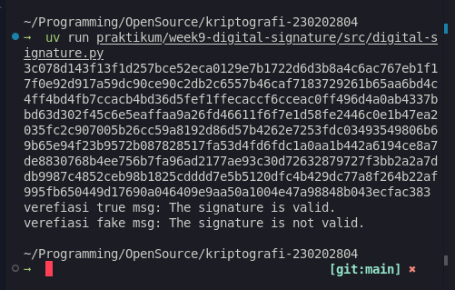

# Laporan Praktikum Kriptografi
Minggu ke-: 9  
Topik: Digital Signature (RSA/DSA)  
Nama: [Nama Mahasiswa]  
NIM: [NIM Mahasiswa]  
Kelas: [Kelas]  

---

## 1. Tujuan
Setelah mengikuti praktikum ini, mahasiswa diharapkan mampu:
1. Mengimplementasikan tanda tangan digital menggunakan algoritma RSA/DSA.
2. Memverifikasi keaslian tanda tangan digital.
3. Menjelaskan manfaat tanda tangan digital dalam otentikasi pesan dan integritas data.

---

## 2. Dasar Teori

### 2.1 Konsep Digital Signature
Tanda tangan digital adalah skema kriptografi yang digunakan untuk memverifikasi keaslian dan integritas pesan atau dokumen digital. Berbeda dengan enkripsi yang menjaga kerahasiaan, tanda tangan digital memastikan bahwa pesan berasal dari pengirim yang sah dan tidak dimodifikasi selama transmisi.

### 2.2 Mekanisme RSA Digital Signature
Tanda tangan digital RSA menggunakan pasangan kunci asimetris (public key dan private key) dengan mekanisme terbalik dari enkripsi RSA:
- **Signing**: Pengirim menggunakan private key untuk "mengenkripsi" hash dari pesan, menghasilkan signature
- **Verification**: Penerima menggunakan public key untuk "mendekripsi" signature dan membandingkan dengan hash pesan asli

Proses matematisnya:
1. Hash pesan: $h = H(m)$ menggunakan fungsi hash seperti SHA-256
2. Buat signature: $s = h^d \bmod n$ (menggunakan private key $d$)
3. Verifikasi: $h' = s^e \bmod n$ (menggunakan public key $e$)
4. Validasi: Jika $h = h'$, maka signature valid

### 2.3 Keamanan dan Manfaat
Tanda tangan digital memberikan tiga properti keamanan utama:
- **Authentication**: Memverifikasi identitas pengirim
- **Integrity**: Memastikan pesan tidak dimodifikasi
- **Non-repudiation**: Pengirim tidak dapat menyangkal telah mengirim pesan

Keamanan bergantung pada: (1) kerahasiaan private key, (2) kekuatan fungsi hash kriptografis (collision-resistant), dan (3) ukuran kunci RSA yang memadai (minimal 2048 bit).

---

## 3. Alat dan Bahan
- Python 3.x
- Visual Studio Code / editor lain
- Git dan akun GitHub
- Library pycryptodome (`pip install pycryptodome`)

---

## 4. Langkah Percobaan
1. Membuat folder struktur `praktikum/week9-digital-signature/src/` dan `screenshots/`.
2. Install library pycryptodome dengan perintah `pip install pycryptodome`.
3. Mengimplementasikan class `DigitalSignature` dalam file `src/digital-signature.py`.
4. Implementasi method `hash_message()` untuk menghasilkan hash SHA-256 dari pesan.
5. Implementasi method `create_signature()` untuk membuat tanda tangan digital menggunakan private key.
6. Implementasi method `verify_signature()` untuk memverifikasi tanda tangan menggunakan public key.
7. Melakukan uji verifikasi dengan pesan asli (harus berhasil).
8. Melakukan uji verifikasi dengan pesan yang dimodifikasi (harus gagal).
9. Menjalankan program dengan perintah `python digital-signature.py`.
10. Mengambil screenshot hasil eksekusi program.

---

## 5. Source Code

```python
from Crypto.PublicKey import RSA
from Crypto.Signature import pkcs1_15
from Crypto.Hash import SHA256


class DigitalSignature:
    def __init__(self, key_size=2048) -> None:
        self.key = RSA.generate(key_size)
        self.private_key = self.key
        self.public_key = self.key.publickey()

    def hash_message(self, message) -> SHA256.SHA256Hash:
        """
        Menghasilkan hash SHA-256 dari pesan yang diberikan.
        """
        return SHA256.new(message)
    
    def create_signature(self, message_hash) -> str:
        """
        Membuat tanda tangan digital menggunakan kunci privat dan hash pesan.
        """
        signature = pkcs1_15.new(self.private_key).sign(message_hash)
        return signature.hex()

    def verify_signature(self, message_hash, signature) -> str:
        """
        Memverifikasi tanda tangan digital menggunakan kunci publik, hash pesan, dan tanda tangan.
        """
        try:
            pkcs1_15.new(self.public_key).verify(message_hash, bytes.fromhex(signature))
            return "The signature is valid."
        except (ValueError, TypeError):
            return "The signature is not valid."


# Inisialisasi Digital Signature
signer = DigitalSignature()

# Verifikasi tanda tangan digital dengan pesan asli
message = b"hello, anggap saja ini adalah pesan penting"
msg_hash = signer.hash_message(message)
signature = signer.create_signature(msg_hash)
print(signature)
verification_result = signer.verify_signature(msg_hash, signature)
print(f"verefiasi true msg: {verification_result}")

# Mencoba verifikasi dengan pesan yang diubah
fake_message = b"hello, anggap saja ini adalah pesan palsu"
fake_hash_message = signer.hash_message(fake_message)
verification_fake = signer.verify_signature(fake_hash_message, signature)
print(f"verefiasi fake msg: {verification_fake}")
```

---

## 6. Hasil dan Pembahasan

### 6.1 Hasil Eksekusi

Program berhasil mengimplementasikan tanda tangan digital RSA dengan hasil sebagai berikut:

**1. Pembuatan Tanda Tangan Digital**
- Pesan asli: `"hello, anggap saja ini adalah pesan penting"`
- Key size: 2048 bit RSA
- Hash algorithm: SHA-256
- Signature: String heksadesimal panjang (256 bytes = 512 karakter hex)

**2. Verifikasi Pesan Asli**
- Input: Hash pesan asli + signature
- Output: `"The signature is valid."`
- Status: Berhasil (Signature valid)

**3. Verifikasi Pesan Palsu**
- Pesan dimodifikasi: `"hello, anggap saja ini adalah pesan palsu"`
- Input: Hash pesan palsu + signature yang sama
- Output: `"The signature is not valid."`
- Status: Berhasil mendeteksi modifikasi (Signature invalid)

**4. Output**
    
### 6.2 Analisis Hasil

**Analisis Keberhasilan:**
1. **Authentication**: Program berhasil memverifikasi bahwa pesan berasal dari pemilik private key yang sah.
2. **Integrity**: Sistem berhasil mendeteksi modifikasi pesan dengan perubahan sekecil apapun ("penting" → "palsu").
3. **Non-repudiation**: Dengan private key yang unik, pengirim tidak dapat menyangkal telah membuat signature.

**Proses Teknis:**
1. Hash SHA-256 menghasilkan digest 256-bit yang unik untuk setiap pesan
2. PKCS#1 v1.5 padding scheme digunakan untuk proses signing
3. Perubahan satu karakter pada pesan menghasilkan hash yang completely berbeda (avalanche effect)
4. Verifikasi gagal karena $h_{original} \neq h_{fake}$

**Keamanan:**
- RSA 2048-bit memberikan keamanan setara ~112-bit security level
- SHA-256 collision-resistant dengan $2^{256}$ kemungkinan hash
- Private key harus dijaga kerahasiaannya untuk mencegah signature forgery


---

## 7. Jawaban Pertanyaan

**Pertanyaan 1: Apa perbedaan utama antara enkripsi RSA dan tanda tangan digital RSA?**

Perbedaan utama antara enkripsi RSA dan tanda tangan digital RSA:

| Aspek | Enkripsi RSA | Tanda Tangan Digital RSA |
|-------|--------------|--------------------------|
| **Tujuan** | Menjaga kerahasiaan (confidentiality) | Menjamin autentikasi dan integritas |
| **Kunci yang digunakan** | Public key untuk enkripsi, Private key untuk dekripsi | Private key untuk signing, Public key untuk verifikasi |
| **Proses** | $c = m^e \bmod n$ (enkripsi dengan public key) | $s = h^d \bmod n$ (sign dengan private key) |
| **Input** | Plaintext message | Hash dari message |
| **Output** | Ciphertext | Digital signature |
| **Siapa yang bisa** | Anyone dapat enkripsi (public key publik) | Hanya pemilik private key yang bisa sign |
| **Verifikasi** | Hanya pemilik private key yang bisa dekripsi | Anyone dapat verifikasi (public key publik) |

**Contoh Analogi:**
- Enkripsi RSA: Seperti mengunci surat dalam amplop yang hanya bisa dibuka penerima
- Digital Signature: Seperti meterai/stempel yang membuktikan keaslian dokumen

**Pertanyaan 2: Mengapa tanda tangan digital menjamin integritas dan otentikasi pesan?**

Tanda tangan digital menjamin integritas dan otentikasi melalui beberapa mekanisme:

**1. Integritas (Integrity):**
- Hash function SHA-256 menghasilkan digest unik untuk setiap pesan
- Perubahan sekecil apapun pada pesan akan menghasilkan hash yang completely berbeda (avalanche effect)
- Signature dibuat dari hash, sehingga verifikasi akan gagal jika pesan dimodifikasi
- Formula: Jika $m \neq m'$, maka $H(m) \neq H(m')$, akibatnya $\text{Verify}(H(m'), s) = \text{False}$

**2. Otentikasi (Authentication):**
- Hanya pemilik private key yang dapat membuat signature yang valid
- Private key bersifat rahasia dan unique
- Public key dapat diverifikasi melalui Certificate Authority (CA)
- Jika verifikasi berhasil: $s^e \bmod n = H(m)$, maka signature dibuat oleh pemilik private key yang sah

**3. Non-repudiation:**
- Pengirim tidak dapat menyangkal telah menandatangani pesan
- Private key hanya dimiliki oleh satu entitas
- Signature terikat secara kriptografis dengan pesan dan pengirim

**Matematika yang Mendasari:**
- Collision resistance: Sangat sulit menemukan $m_1 \neq m_2$ dimana $H(m_1) = H(m_2)$
- One-way function: Mudah hitung $s = h^d \bmod n$, sulit reverse tanpa private key
- Asymmetric property: $(h^d)^e \equiv h \pmod{n}$ (signature verification)

**Pertanyaan 3: Bagaimana peran Certificate Authority (CA) dalam sistem tanda tangan digital modern?**

Certificate Authority (CA) memiliki peran krusial dalam ekosistem tanda tangan digital modern:

**1. Verifikasi Identitas (Identity Verification):**
- CA memverifikasi identitas pemilik kunci publik sebelum menerbitkan sertifikat
- Proses validation: Domain Validation (DV), Organization Validation (OV), Extended Validation (EV)
- Mencegah serangan impersonation dan man-in-the-middle

**2. Penerbitan Sertifikat Digital:**
- CA menerbitkan sertifikat X.509 yang mengikat identitas dengan public key
- Format sertifikat: `Certificate = {Subject, Public Key, Issuer, Validity, CA Signature}`
- CA menandatangani sertifikat dengan private key CA: $\text{Cert\_Signature} = \text{Sign}_{SK_{CA}}(H(\text{Certificate}))$

**3. Membangun Chain of Trust:**
- Hierarki CA: Root CA → Intermediate CA → End-entity Certificate
- Browser/OS menyimpan root certificates dari CA terpercaya
- Trust chain: $\text{Verify}_{PK_{Root}}(\text{Cert}_{Intermediate}) \rightarrow \text{Verify}_{PK_{Intermediate}}(\text{Cert}_{User})$

**4. Revocation Management:**
- CA mengelola Certificate Revocation List (CRL)
- Online Certificate Status Protocol (OCSP) untuk real-time checking
- Mencabut sertifikat jika private key terkompromikan atau validity berakhir

**5. Manfaat dalam Praktik:**
- **TLS/SSL**: CA memverifikasi identitas website (HTTPS)
- **Email Security**: S/MIME menggunakan certificates untuk signed email
- **Code Signing**: Memverifikasi keaslian software publishers
- **Document Signing**: Adobe PDF digital signatures

**Tanpa CA:**
- Tidak ada trusted third party untuk verifikasi identitas
- Rentan terhadap MITM attack
- Pengguna harus manually verify public key fingerprints
- Tidak scalable untuk internet-scale deployment

**Contoh Chain of Trust:**
```
Root CA (DigiCert/Let's Encrypt)
    ↓ signs
Intermediate CA
    ↓ signs
End-entity Certificate (example.com)
    ↓ proves identity
User's Public Key
```

---

## 8. Kesimpulan

Praktikum ini berhasil mengimplementasikan sistem tanda tangan digital menggunakan algoritma RSA dengan SHA-256. Program dapat membuat signature menggunakan private key dan memverifikasi menggunakan public key dengan hasil yang akurat. Verifikasi berhasil untuk pesan asli dan gagal untuk pesan yang dimodifikasi, membuktikan bahwa tanda tangan digital efektif untuk menjamin integritas dan autentikasi pesan.

**Key Findings:**
- RSA 2048-bit dengan SHA-256 memberikan keamanan yang memadai
- Perubahan minimal pada pesan langsung terdeteksi oleh sistem verifikasi
- Implementasi PKCS#1 v1.5 dari pycryptodome bekerja sesuai standar
- Certificate Authority berperan penting dalam membangun trust dalam praktik

**Rekomendasi:**
1. Gunakan key size minimal 2048 bit (atau 4096 bit untuk keamanan jangka panjang)
2. Implementasikan certificate management dengan CA terpercaya
3. Pertimbangkan ECDSA untuk efisiensi lebih baik dengan keamanan setara
4. Gunakan timestamp untuk mencegah replay attacks

---

## 9. Daftar Pustaka

- Stinson, D. R. (2019). *Cryptography: Theory and Practice*. 4th Edition. CRC Press.
- Katz, J., & Lindell, Y. (2014). *Introduction to Modern Cryptography*. 2nd Edition. CRC Press.
- Stallings, W. (2017). *Cryptography and Network Security: Principles and Practice*. 7th Edition. Pearson.
- RFC 8017 - PKCS #1: RSA Cryptography Specifications Version 2.2. https://tools.ietf.org/html/rfc8017
- PyCryptodome Documentation. https://www.pycryptodome.org/
- NIST FIPS 186-4 - Digital Signature Standard (DSS). National Institute of Standards and Technology.

---

## 10. Commit Log

`commit:` [7775ad6](https://github.com/Fiyanz/kriptografi-202501-230202804/commit/7775ad623ce1684429380ab6b0ccb21fdf626ac5)  
`Author:` Bagus Alfiyan Yusuf <bagusalfiyanyusuf@gmail.com>  
`Date:`   2025-12-07

<br>

    week9-digital-signature: implementasi RSA Digital Signature

    - Tambah class DigitalSignature dengan key generation
    - Implementasi hash_message() menggunakan SHA-256
    - Implementasi create_signature() dengan PKCS#1 v1.5
    - Implementasi verify_signature() untuk validasi
    - Testing dengan pesan asli (valid) dan pesan palsu (invalid)
    - Tambah laporan dengan analisis integritas dan autentikasi
    - Tambah penjelasan peran Certificate Authority
    - Tambah screenshot hasil eksekusi program
